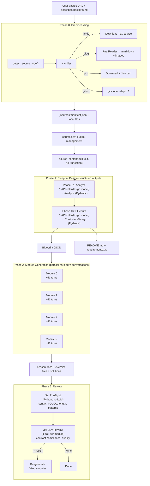
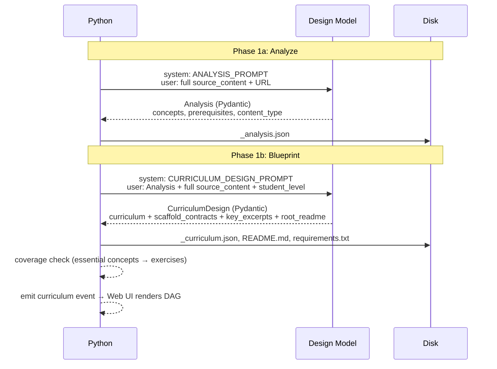
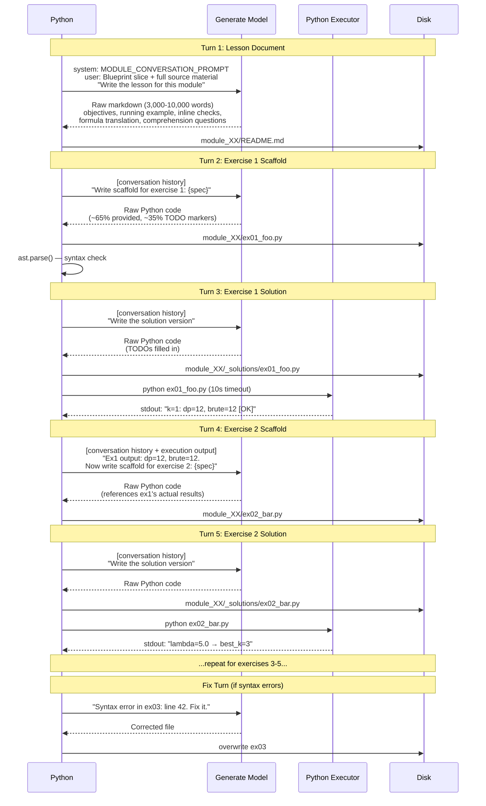
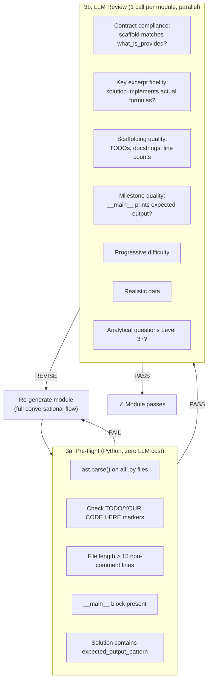
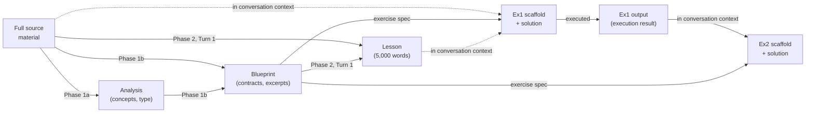

# Architecture

## Overview

Scaffoldly transforms a URL (blog post, paper, repo) into a hands-on course through a 4-phase pipeline. Phase 1 uses structured output to produce a Blueprint. Phase 2 uses multi-turn conversations to produce lesson documents and exercises. Phase 3 validates and reviews.



## Phase 1: Blueprint Design

Two structured output calls using the design model. The Blueprint is the sole coordination mechanism between phases — Phase 2 modules never see each other's output.



### Blueprint Schema

```
CurriculumDesign
├── curriculum
│   ├── course_title, course_description
│   └── modules[]
│       ├── title, description, learning_objectives
│       ├── depends_on[]                          ← module dependency graph
│       ├── key_excerpts[]                        ← verbatim formulas from source
│       ├── exercises[]
│       │   ├── title, type, scaffolding_level
│       │   ├── what_is_provided                  ← "class Node with __init__, import block, __main__ harness"
│       │   ├── what_student_writes               ← "Node.backward() ~8-12 lines; compute_loss() ~5-8 lines"
│       │   ├── key_insight                       ← "backward() must accumulate gradients at fan-out nodes"
│       │   ├── common_mistakes                   ← "forgetting to zero gradients between batches"
│       │   ├── milestone                         ← "prints gradient table, all errors < 1e-5"
│       │   └── expected_output_pattern           ← "relative error"
│       └── inline_questions[]
├── shared_definitions
│   ├── language, dependencies[], naming_convention
├── root_readme                                   ← full course README.md content
└── requirements                                  ← requirements.txt content
```

## Phase 2: Module Generation

Each module is generated through a **multi-turn conversation**. Modules run in parallel across `anyio.create_task_group()`, but turns within a module are sequential — each turn sees all prior turns.



### Why conversations, not single-shot

```
SINGLE-SHOT (old, broken):
  1 API call → JSON blob with ALL files → hope it works

  Result: 200-word READMEs, empty exercise shells, param*42

CONVERSATIONAL (current):
  Turn 1: Write 5,000-word lesson (deep source engagement)
  Turn 2: Write ex1 scaffold (full attention on one file)
  Turn 3: Write ex1 solution → EXECUTE → see output
  Turn 4: Write ex2 scaffold (references ex1's real output)
  ...

  Result: MIT-quality lessons, working exercises, real numbers
```

### Parallel execution model

```mermaid
gantt
    title Phase 2: Module Generation (parallel)
    dateFormat X
    axisFormat %s

    section Module 0
    Lesson (Turn 1)        :m0t1, 0, 15
    Ex1 scaffold (Turn 2)  :m0t2, after m0t1, 5
    Ex1 solution (Turn 3)  :m0t3, after m0t2, 5
    Ex2 scaffold (Turn 4)  :m0t4, after m0t3, 5
    Ex2 solution (Turn 5)  :m0t5, after m0t4, 5
    Ex3 scaffold (Turn 6)  :m0t6, after m0t5, 5
    Ex3 solution (Turn 7)  :m0t7, after m0t6, 5

    section Module 1
    Lesson (Turn 1)        :m1t1, 0, 15
    Ex1 scaffold (Turn 2)  :m1t2, after m1t1, 5
    Ex1 solution (Turn 3)  :m1t3, after m1t2, 5
    Ex2 scaffold (Turn 4)  :m1t4, after m1t3, 5
    Ex2 solution (Turn 5)  :m1t5, after m1t4, 5
    Ex3 scaffold (Turn 6)  :m1t6, after m1t5, 5
    Ex3 solution (Turn 7)  :m1t7, after m1t6, 5

    section Module 2
    Lesson (Turn 1)        :m2t1, 0, 15
    Ex1 scaffold (Turn 2)  :m2t2, after m2t1, 5
    Ex1 solution (Turn 3)  :m2t3, after m2t2, 5
    Ex2 scaffold (Turn 4)  :m2t4, after m2t3, 5
    Ex2 solution (Turn 5)  :m2t5, after m2t4, 5
    Ex3 scaffold (Turn 6)  :m2t6, after m2t5, 5
    Ex3 solution (Turn 7)  :m2t7, after m2t6, 5
```



All modules start simultaneously. Within each module, turns are sequential (each turn sees prior context). Total wall-clock time ≈ time for the slowest module, not the sum.

## Phase 3: Review



## Data Flow

What each phase sees:



Key property: **the full source material is available at every turn**. No truncation, no summarization. The model reads the actual blog/paper formulas while writing code.

## Cost Model

For a 5-module course with 3 exercises each, using GPT-5.4:

| Phase | Calls | Input tokens | Output tokens | Cost |
|---|---|---|---|---|
| 1a: Analyze | 1 | ~15K | ~3K | ~$0.08 |
| 1b: Blueprint | 1 | ~25K | ~8K | ~$0.18 |
| 2: Generate | 5 modules × ~7 turns | ~200K/module | ~25K/module | ~$6.50 |
| 3: Review | 5 | ~30K/module | ~2K/module | ~$0.55 |
| **Total** | **~40** | **~1.2M** | **~140K** | **~$7.30** |

Phase 2 dominates cost because conversations accumulate context. Each module's later turns re-read the lesson + prior exercises. This is the price of quality — the model needs that context to produce coherent, progressive exercises.

## Stack

```
┌─────────────────────────────────────────┐
│  Web UI (vanilla JS, SSE, DAG viz)      │
├─────────────────────────────────────────┤
│  Starlette + Uvicorn (web server)       │
├─────────────────────────────────────────┤
│  pipeline.py (orchestration)            │
│  ├── Phase 1: Instructor (structured)   │
│  ├── Phase 2: raw completions (conv.)   │
│  └── Phase 3: Instructor (structured)   │
├─────────────────────────────────────────┤
│  LLMClient (llm.py)                     │
│  ├── LiteLLM (provider routing)         │
│  ├── Instructor (Pydantic validation)   │
│  └── Cost tracking                      │
├─────────────────────────────────────────┤
│  Provider APIs                          │
│  OpenAI / Anthropic / Google / Ollama   │
└─────────────────────────────────────────┘
```

No LangChain, no LangGraph, no agent frameworks. Direct API calls through LiteLLM, with Instructor for structured output in Phases 1 and 3, and raw chat completions for Phase 2 conversations.
