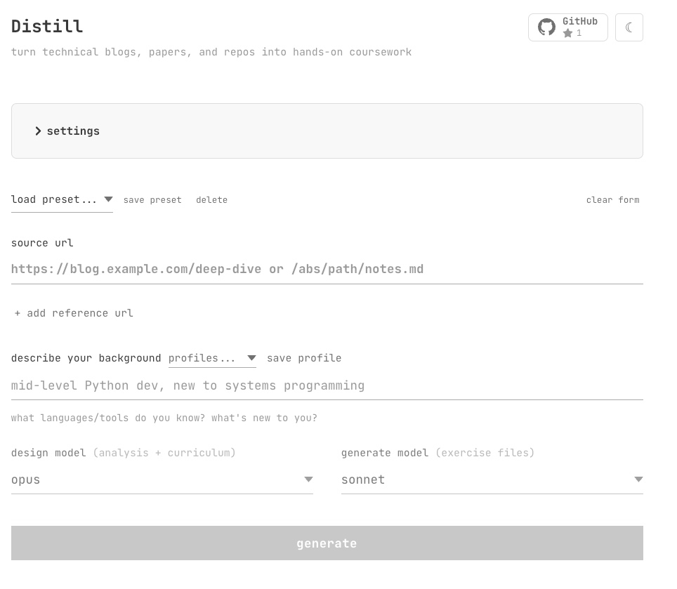

# Distill

**Paste a URL. Pick your level. Get a course.**

Distill takes expert-level content — deep blog posts, arXiv papers, GitHub repos — and generates progressive courses with lesson documents, scaffolded exercises, and observable milestones. Each course builds toward reproducing the author's results.

<div align="center">

[](https://github.com/TAOGenna/Distill/raw/main/assets/Distill-demo.mp4)

</div>

> **Lesson documents, not summaries** — 3,000–10,000 word teaching documents with running examples, inline code, comprehension checks, and formula walkthroughs.

> **Exercises you can actually run** — scaffolded `.py` files with TODO blocks, docstrings, and a `__main__` test harness. Solutions included.

## Install

```bash
git clone https://github.com/TAOGenna/Distill.git
cd Distill
uv sync
uv run python -m distill
# → opens http://localhost:8420
```

## How It Works

**Phase 1 — Blueprint.** Reads the full source material and produces a curriculum: module dependencies, scaffold contracts per exercise (what's provided vs what the student writes), key excerpts, and validation criteria.

**Phase 2 — Generate.** Each module gets a multi-turn conversation with the full source. The model writes the lesson first (deep processing), then exercises one at a time. Solutions are executed between turns — real output from exercise 1 feeds into exercise 2's prompt. Modules generate in parallel.

**Phase 3 — Review.** Pre-flight checks (syntax, TODOs, output patterns) catch structural issues. LLM review checks pedagogical quality and contract compliance. Failed modules are re-generated.

## Acknowledgments

Inspired by [karpathify](https://github.com/nuwandavek/karpathify), Stanford's [CS231n](https://cs231n.stanford.edu/) assignments, [MIT 6.102](https://web.mit.edu/6.102/www/sp26/) course readings, Simon Boehm and Alexa Godric's blog style and beautiful excalidraws.
