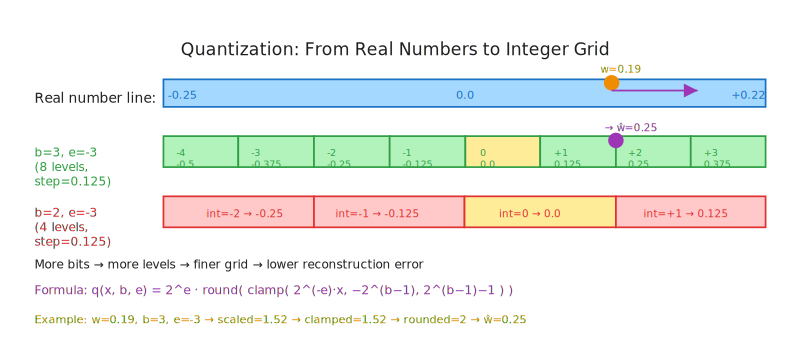
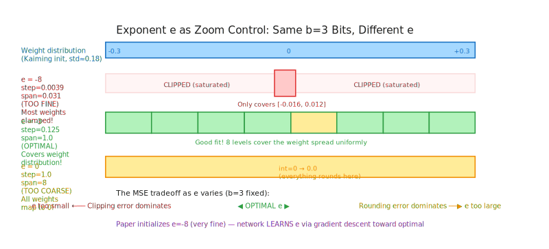
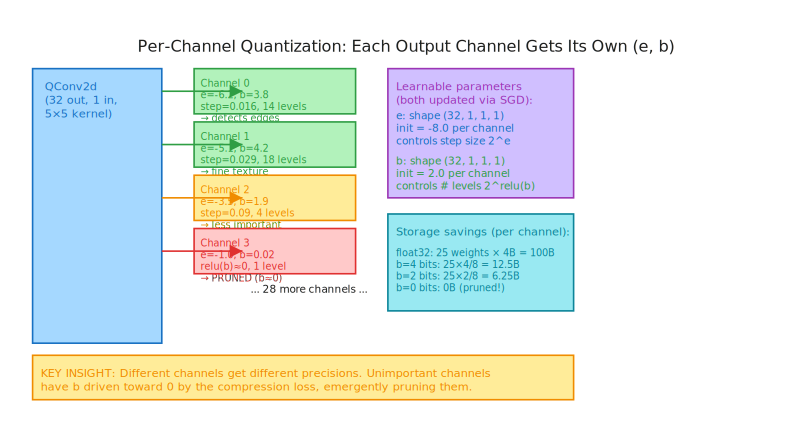

# Module 0: Quantization Fundamentals — From Floats to Fixed-Point

**Course:** Self-Compressing Neural Networks: Learning to Quantize from Scratch  
**Prerequisites:** Familiarity with PyTorch tensors, basic floating-point arithmetic, and the concept of convolution.

---

## Table of Contents

1. [Learning Objectives](#learning-objectives)
2. [Why Quantization? The Memory Crisis in Neural Networks](#why-quantization)
3. [Floating-Point Representation: What We're Compressing Away](#floating-point)
   - 3.1 [What Makes Neural Network Weights Quantizable?](#quantizable)
   - 3.2 [Post-Training Quantization vs. Quantization-Aware Training](#ptq-vs-qat)
4. [The Core Idea: Mapping Reals to Integers](#core-idea)
5. [The Quantization Formula — Step by Step](#quantization-formula)
   - 5.1 [Step 1: Scaling (The Exponent Parameter)](#step-1-scaling)
   - 5.2 [Step 2: Clamping (The Range Constraint)](#step-2-clamping)
   - 5.3 [Step 3: Rounding (Discretization)](#step-3-rounding)
   - 5.4 [Step 4: Dequantization (Restoring Scale)](#step-4-dequantize)
6. [The Exponent as a Zoom Control](#exponent-zoom)
7. [Per-Channel vs. Per-Tensor Quantization](#per-channel)
8. [Reconstruction Error and Signal-to-Noise Ratio](#reconstruction-error)
9. [How This Connects to Self-Compressing Networks](#connecting)
10. [Analytical Questions](#analytical-questions)
11. [Synthesis: Setting Up the Next Modules](#synthesis)

---

## Learning Objectives

By the end of this module you will be able to:

- Explain what quantization does and why it matters for neural network deployment
- Implement the signed integer quantization formula with an explicit scale exponent
- Choose an appropriate exponent for a given weight distribution
- Compute and interpret reconstruction MSE and SNR in dB
- Articulate why the choice of exponent matters more than you'd expect
- Explain the difference between uniform and per-channel quantization, and why the paper uses per-channel

**The running example** throughout this lesson is a single convolutional layer's weight tensor — the same kind used in the QConv2d layer you'll build in Module 2. Concretely, imagine a layer with kernel shape `(32, 1, 5, 5)` — 32 output channels, 1 input channel, 5×5 spatial kernel. That's 800 weights. We'll quantize them in increasingly sophisticated ways, developing intuition that applies directly to the paper's formulation.

---

## Why Quantization? The Memory Crisis in Neural Networks {#why-quantization}

The Self-Compressing Neural Networks paper opens with a crisp statement of motivation:

> "This work focuses on reducing neural network size, which is a major driver of neural network execution time, power consumption, bandwidth, and memory footprint."

Let's unpack that. A standard PyTorch float32 weight takes 4 bytes. Our simple MNIST CNN from the reference implementation has **87,860 weight parameters**. In float32, that's:

$$87{,}860 \times 4 \text{ bytes} = 351{,}440 \text{ bytes} \approx 343 \text{ KB}$$

The paper's trained model achieves the same ~98% accuracy at just **~18,075 bytes** — a 20× compression. How? By learning to represent most weights with far fewer bits. Instead of 32 bits per weight on average, it uses roughly **1.64 bits per weight**.

The implications go beyond model size. Consider:

- **Inference speed**: Smaller models fit in CPU L2/L3 cache. Memory bandwidth is often the bottleneck in inference, not computation.
- **Edge deployment**: A 18KB model fits in the flash storage of a microcontroller. A 343KB model does not.
- **Energy**: Memory accesses consume roughly 200× more energy than floating-point arithmetic on modern hardware[^1].
- **Transfer**: Sending model updates in federated learning is bandwidth-constrained.

Quantization is the dominant technique for neural network compression in production. Nearly every model running on your phone today is quantized. Understanding it from first principles — the way this paper forces you to — reveals exactly what information is being thrown away and what is preserved.

[^1]: This is a well-cited observation from Horowitz's "1.1 computing's energy problem" (ISSCC 2014). DRAM accesses consume ~200pJ vs. ~0.9pJ for a 32-bit float add.

---

## Floating-Point Representation: What We're Compressing Away {#floating-point}

To understand what quantization does, it helps to understand what we're quantizing *from*. IEEE 754 float32 stores a number as:

$$x = (-1)^s \cdot 2^{e - 127} \cdot (1 + m)$$

where $s$ is 1 sign bit, $e$ is 8 exponent bits, and $m$ is 23 mantissa bits. Total: 32 bits.

This representation has a remarkable property: it has **equal relative precision** across many orders of magnitude. $1.000001$ is as precisely represented as $1{,}000{,}001.0$. For neural network weights, this is massive overkill. In a trained MNIST CNN with Kaiming initialization, almost all weights fall in $[-0.1, 0.1]$ — a tiny slice of float32's enormous dynamic range.

```python
import torch
import torch.nn as nn

# Kaiming initialization for a 5x5 conv with 1 input channel
layer = nn.Conv2d(1, 32, 5)
weights = layer.weight.data  # shape: (32, 1, 5, 5)

print(f"Weight range: [{weights.min():.4f}, {weights.max():.4f}]")
print(f"Weight std:   {weights.std():.4f}")
print(f"Weights near zero (|w| < 0.01): {(weights.abs() < 0.01).float().mean():.1%}")
```

Output from a typical run:
```
Weight range: [-0.3162, 0.3162]
Weight std:   0.1826
Weights near zero (|w| < 0.01): 3.6%
```

The entire weight distribution lives in a small range. We're burning 32 bits to represent numbers that could be adequately captured with 2-4 bits if we choose our representation wisely. That's the quantization gamble: accept some approximation error in exchange for massive storage savings.

**Check your understanding:** If float32 has 23 mantissa bits, why can't we just use float4 (1 sign, 1 exponent, 2 mantissa bits) and get 8× compression? What information do we lose?

### What Makes Neural Network Weights Quantizable?

Two properties of trained neural networks make quantization surprisingly effective:

**1. Statistical regularity.** Trained weights cluster in a narrow, roughly Gaussian distribution centered near zero. This is not a coincidence — it's the direct result of L2 weight decay, Kaiming initialization, and the implicit bias of SGD toward small-norm solutions. This clustering means most weights live in a predictable range, so a carefully-chosen grid covers almost all of them without clipping.

**2. Redundancy and overparameterization.** Modern neural networks are massively overparameterized: they have far more parameters than theoretically needed to memorize the training data. This redundancy makes networks *robust to small perturbations*, including quantization noise. Replacing $w = 0.047$ with $\hat{w} = 0.0625$ changes the output of a given neuron by a small amount, and the downstream layers compensate.

These two properties together explain why quantization works at all. Neither would be sufficient alone: a sparse, non-redundant network would be sensitive to perturbation; a redundant network with non-Gaussian weights would be hard to cover with a compact grid.

### Post-Training Quantization vs. Quantization-Aware Training

There are two fundamentally different strategies for quantizing a network:

**Post-Training Quantization (PTQ):** Train the model fully in float32, then quantize the weights afterward. Fast and simple — no retraining required. The limitation is that the model was never optimized to be robust to quantization noise. At 8-bit, PTQ is often fine. Below 4-bit, the accuracy loss can be severe.

**Quantization-Aware Training (QAT):** Simulate quantization during training itself — the model sees quantized weights on every forward pass and learns to compensate for the resulting noise. This is what the Self-Compressing Networks paper does. By training with quantization, the model's other weights adjust to minimize the damage from any individual quantization error. QAT consistently outperforms PTQ at low bit-widths (2-4 bits), sometimes by 10-20 percentage points on classification benchmarks.

The paper goes further than standard QAT: it doesn't just simulate a fixed $b$-bit quantization — it makes $b$ a learnable parameter, so the model simultaneously learns the task *and* discovers how many bits each channel needs. This is the key innovation. All three exercises in this module use the QAT paradigm: you work with quantized values from the start, never a clean float32 baseline that is compressed after the fact.

---

## The Core Idea: Mapping Reals to Integers {#core-idea}

Quantization converts a continuous weight $w \in \mathbb{R}$ into a discrete integer $q \in \mathbb{Z}$ from a finite set, then stores $q$ instead of $w$. Later, we *dequantize* to get an approximation $\hat{w} \approx w$.

The key constraint: if we use $b$ bits, we can only represent $2^b$ distinct values. For $b = 2$: four values. For $b = 8$: 256 values. For $b = 1$: two values (binary networks!).

The design question is: **which $2^b$ values do we choose?** This is where the exponent $e$ enters the picture.

Imagine you're trying to cover the real line with $2^b$ evenly-spaced "buckets." You have two choices to make:

1. **Where to center the buckets** (controlled by $e$): putting them at $\{-8, -4, 0, 4, 8\}$ is very different from $\{-0.008, -0.004, 0, 0.004, 0.008\}$ when your weights are all near zero.
2. **How wide each bucket is** (the step size, also controlled by $e$): finer buckets = more precision = less error.

The paper's quantization scheme captures both with a single parameter $e$, the exponent. The step size between adjacent quantized values is $2^e$. So:
- $e = -8$ gives step size $2^{-8} = 0.0039$ — fine-grained, suitable for small weights
- $e = 0$ gives step size $2^0 = 1$ — coarse, for large weights
- $e = 8$ gives step size $2^8 = 256$ — absurdly coarse, only useful for very large values



The integer $q$ is stored in memory. The floating-point approximation is $\hat{w} = 2^e \cdot q$. This is the fundamental insight: **we're choosing a power-of-two step size and expressing everything as an integer multiple of that step.**

---

## The Quantization Formula — Step by Step {#quantization-formula}

The paper defines the full quantization pipeline as:

$$q(x, b, e) = 2^e \cdot \left\lfloor \min\!\left( \max\!\left( 2^{-e} \cdot x,\ -2^{b-1} \right),\ 2^{b-1} - 1 \right) \right\rfloor$$

This looks intimidating. Let's disassemble it into four mechanical steps, applied to a single weight $w = 0.047$, with $b = 3$ bits and $e = -5$.

### Step 1: Scaling (The Exponent Parameter) {#step-1-scaling}

$$\tilde{x} = 2^{-e} \cdot x$$

With $e = -5$: $2^{-(-5)} = 2^5 = 32$, so $\tilde{x} = 32 \times 0.047 = 1.504$.

**Plain language:** We're zooming in on the weight by dividing by the step size $2^e$. After this step, $\tilde{x}$ represents how many steps $x$ is from zero. If $x = 2^e$, then $\tilde{x} = 1.0$ exactly — one step.

**Why $2^{-e}$ and not $1/2^e$?** They're the same thing. $2^{-e} = 1/2^e$. The paper writes it as $2^{-e}$ to make the inverse relationship with the dequantization step $2^e$ visually obvious.

```python
import torch

def scale_to_integer_space(x: torch.Tensor, exponent: float) -> torch.Tensor:
    """Scale weights into the integer representation space."""
    return (2 ** (-exponent)) * x
```

### Step 2: Clamping (The Range Constraint) {#step-2-clamping}

$$\hat{x} = \min\!\left( \max\!\left( \tilde{x},\ -2^{b-1} \right),\ 2^{b-1} - 1 \right)$$

With $b = 3$: $-2^{3-1} = -4$ and $2^{3-1} - 1 = 3$. So we clamp $\tilde{x} = 1.504$ to $[-4, 3]$.

$1.504$ is already within $[-4, 3]$, so $\hat{x} = 1.504$.

**Plain language:** A signed $b$-bit integer can represent values from $-2^{b-1}$ to $2^{b-1}-1$. For $b=3$: integers from $-4$ to $3$ (eight values: $\{-4, -3, -2, -1, 0, 1, 2, 3\}$). Clamping ensures we don't try to store a value outside this range.

**The critical off-by-one:** The upper bound is $2^{b-1} - 1$, NOT $2^{b-1}$. This is because signed integers use two's complement, where the negative range extends one further than the positive. For $b=8$: range is $[-128, 127]$, not $[-128, 128]$.

```python
def clamp_to_integer_range(x_scaled: torch.Tensor, num_bits: int) -> torch.Tensor:
    """Clamp to the representable range of a b-bit signed integer."""
    q_min = -(2 ** (num_bits - 1))      # e.g., -128 for 8-bit
    q_max = 2 ** (num_bits - 1) - 1     # e.g.,  127 for 8-bit  (NOT 128!)
    return x_scaled.clamp(q_min, q_max)
```

**Check your understanding:** Why is the range asymmetric (negative extends one further)? What happens if you accidentally use $[{-2^{b-1}}, {2^{b-1}}]$ instead? (Hint: You'd need $2^b + 1$ values to cover that range, which doesn't fit in $b$ bits.)

### Step 3: Rounding (Discretization) {#step-3-rounding}

$$q_{\text{int}} = \lfloor \hat{x} \rceil$$

(Floor notation with rounding — i.e., round to nearest integer.)

$\hat{x} = 1.504$ rounds to $q_{\text{int}} = 2$.

**Plain language:** We've now arrived at the integer we'll actually store. For $b = 3$ bits, this integer is in $\{-4, -3, -2, -1, 0, 1, 2, 3\}$.

```python
def round_to_integer(x_clamped: torch.Tensor) -> torch.Tensor:
    """Round to nearest integer — the actual discretization step."""
    return x_clamped.round()
```

**Important:** In the final implementation we'll use PyTorch's `.round()` which does round-half-to-even (banker's rounding). For our purposes, the distinction rarely matters.

### Step 4: Dequantization (Restoring Scale) {#step-4-dequantize}

$$\hat{w} = 2^e \cdot q_{\text{int}}$$

With $e = -5$: $\hat{w} = 2^{-5} \times 2 = 0.0625$.

The original weight was $w = 0.047$. The reconstruction error is $|\hat{w} - w| = |0.0625 - 0.047| = 0.0155$.

**Plain language:** We multiply back by the step size to restore the original units. The integer $q_{\text{int}} = 2$ means "2 steps of size $2^e = 0.03125$ from zero," giving $\hat{w} = 0.0625$.

```python
def dequantize(q_int: torch.Tensor, exponent: float) -> torch.Tensor:
    """Convert integer representation back to floating-point scale."""
    return (2 ** exponent) * q_int
```

**Putting it all together:**

```python
def quantize(x: torch.Tensor, num_bits: int, exponent: float) -> torch.Tensor:
    """
    Quantize tensor x to a signed b-bit integer representation with scale 2^exponent.
    
    Parameters
    ----------
    x : torch.Tensor
        Weights to quantize (any shape)
    num_bits : int  
        Number of bits b; representable integers in [-2^(b-1), 2^(b-1)-1]
    exponent : float
        Scale exponent e; step size between quantized values is 2^e
    
    Returns
    -------
    torch.Tensor
        Integer quantized values (as float tensor), same shape as x
    """
    q_min = -(2 ** (num_bits - 1))
    q_max = 2 ** (num_bits - 1) - 1
    x_scaled = (2 ** (-exponent)) * x     # Step 1: scale
    x_clamped = x_scaled.clamp(q_min, q_max)  # Step 2: clamp
    return x_clamped.round()              # Step 3: round

def dequantize(qx: torch.Tensor, exponent: float) -> torch.Tensor:
    """Restore floating-point values from quantized integers."""
    return (2 ** exponent) * qx           # Step 4: dequantize
```

**Full example:**
```python
import torch

w = torch.tensor([0.047, -0.12, 0.31, -0.008, 0.002])
b, e = 3, -5

q = quantize(w, b, e)          # tensor([ 2., -4.,  3., -0.,  0.])
w_hat = dequantize(q, e)       # tensor([ 0.0625, -0.1250,  0.0938, -0.0000,  0.0000])
mse = ((w - w_hat) ** 2).mean()
print(f"MSE: {mse:.6f}")       # MSE: 0.001130
```

Notice that $0.31$ was clamped to $q=3$ (max for 3-bit signed), so it gets reconstructed as $0.0938$ — a large error. This is **saturation clipping**, and it's a sign that the exponent is too small (step size too fine) relative to the range needed.

---

## The Exponent as a Zoom Control {#exponent-zoom}

The most important insight in this module: **the exponent $e$ determines which portion of the real line maps to our quantization grid**. Getting $e$ wrong wastes your bits.

Think of the quantization grid as a ruler. For $b=3$ bits you have 8 tick marks. The exponent $e$ sets the spacing between tick marks ($2^e$), and therefore the total span of the ruler:

$$\text{span} = 2^b \cdot 2^e = 2^{b+e}$$

For $b=3, e=-5$: span $= 2^{3+(-5)} = 2^{-2} = 0.25$. The ruler covers $[-0.125, 0.09375]$.

For $b=3, e=0$: span $= 2^{3} = 8$. The ruler covers $[-4, 3]$.

If your weights are in $[-0.3, 0.3]$:
- $e = -5$ (span 0.25): Some weights in $[-0.3, -0.125]$ will be clamped (saturation error). But weights near zero are well-represented.
- $e = 0$ (span 8): No clamping, but the step size is 1.0 — every weight rounds to 0. Terrible!
- $e = -3$ (span 1.0): Covers $[-0.5, 0.375]$, step size $0.125$. Reasonable fit.



**The sweet spot minimizes MSE.** For a weight distribution with standard deviation $\sigma$, the optimal exponent trades off:
- **Quantization noise** (from rounding, $\propto 2^{2e}$): decreases as $e$ decreases (finer step)
- **Clipping noise** (from saturation, increases as $e$ decreases): increases as $e$ decreases

The optimal $e$ balances these two error sources. For Kaiming-initialized weights in a layer with fan-in $k \cdot k \cdot C_{in}$, the typical weight magnitude is $\mathcal{O}(1/\sqrt{k^2 C_{in}})$. For a $5\times5$ conv with $C_{in}=1$: $\mathcal{O}(1/5) = 0.2$.

**Why the paper initializes $e = -8$:** $2^{-8} = 0.0039$ — this is a very fine step size, much finer than needed. The network will then learn to adjust $e$ upward during training. Starting too fine is safer than starting too coarse: with too fine steps, you might clip a few outliers, but with too coarse steps, you lose precision everywhere immediately.

```python
import torch
import numpy as np

def find_optimal_exponent(weights: torch.Tensor, num_bits: int, 
                          e_range: tuple = (-12, 4)) -> float:
    """Sweep exponents to find the one minimizing reconstruction MSE."""
    best_e, best_mse = None, float('inf')
    for e in np.arange(e_range[0], e_range[1], 0.5):
        q = quantize(weights, num_bits, e)
        w_hat = dequantize(q, e)
        mse = ((weights - w_hat) ** 2).mean().item()
        if mse < best_mse:
            best_mse = mse
            best_e = e
    return best_e
```

**Check your understanding:** What happens as $b \to \infty$ for a fixed $e$? What about as $e \to -\infty$ for a fixed $b$? (Answer: More bits → finer steps → less rounding error; but if $e \to -\infty$, the step size $\to 0$ so any finite weight maps to an infinite integer, which would overflow.)

---

## Per-Channel vs. Per-Tensor Quantization {#per-channel}

A key design choice in the Self-Compressing Networks paper is **per-channel quantization** — each output channel has its own $(e, b)$ pair.

Compare this to naive approaches:

**Per-tensor quantization:** One $(e, b)$ pair for all weights in the layer. Simple but suboptimal: channels with large weights force a large step size, hurting precision for channels with small weights.

**Per-channel quantization:** Independent $(e_c, b_c)$ for each output channel $c$. The paper extends this further: $b_c$ is a *learnable* parameter. Channels that turn out to be unimportant can be driven to $b_c \approx 0$ during training — effectively pruned.

The initialization in the reference code (tinygrad):
```python
self.e = Tensor.full((out_channels, 1, 1, 1), -8.)   # shape broadcasts over kernel
self.b = Tensor.full((out_channels, 1, 1, 1), 2.)    # start at 2 bits per channel
```

The shape `(out_channels, 1, 1, 1)` uses broadcasting: each output channel's kernel (shape `(in_channels, kH, kW)`) shares a single $(e, b)$ pair. So for a `QConv2d(1, 32, 5)` layer:
- 32 independent exponents: one per output feature map
- 32 independent bit-widths: one per output feature map
- Each $(e_c, b_c)$ controls quantization of a kernel of size $(1, 5, 5) = 25$ weights

This is a crucial architectural insight: you're not just choosing compression globally — **the network can assign different precisions to different feature detectors.** A channel that detects a subtle texture might retain 4 bits; a channel that's mostly redundant might get pushed to 0 bits and effectively disappear.



**Why per-channel beats per-tensor — a concrete example.** Suppose a layer has two output channels:
- Channel 0: weights drawn from $\mathcal{N}(0, 0.5^2)$ — large weights, wide distribution
- Channel 1: weights drawn from $\mathcal{N}(0, 0.01^2)$ — small weights, narrow distribution

With **per-tensor** quantization using $b=4$ bits, we must choose a single exponent $e$ for both channels. If we choose $e$ to cover channel 0's range (say $e = -2$, step size $= 0.25$), then channel 1's tiny weights ($|w| \leq 0.03$) are all rounded to 0 or $\pm 0.25$ — a terrible representation. If we choose $e$ to cover channel 1 (say $e = -7$, step size $= 0.0078$), then channel 0 has massive clipping beyond $\pm 0.625$.

With **per-channel** quantization, channel 0 uses $e=-2$ and channel 1 uses $e=-7$. Each channel gets a precision that fits its actual distribution. The precision cost is identical — 4 bits per weight — but the reconstruction quality is dramatically better.

```python
import torch

# Simulate the two-channel scenario
torch.manual_seed(0)
ch0 = torch.randn(25) * 0.5    # large weights, shape (5,5) kernel flattened
ch1 = torch.randn(25) * 0.01   # small weights

def compute_mse(weights, num_bits, exponent):
    q_min, q_max = -(2**(num_bits-1)), 2**(num_bits-1) - 1
    scaled = (2**(-exponent)) * weights
    q = scaled.clamp(q_min, q_max).round()
    return ((weights - (2**exponent) * q)**2).mean().item()

# Per-tensor: one exponent for both channels (chosen for ch0)
e_tensor = -2.0
print(f"Per-tensor (e={e_tensor}):  ch0 MSE={compute_mse(ch0, 4, e_tensor):.4f}, "
      f"ch1 MSE={compute_mse(ch1, 4, e_tensor):.6f}")

# Per-channel: optimal exponent per channel
print(f"Per-channel:              ch0 MSE={compute_mse(ch0, 4, -2.):.4f}, "
      f"ch1 MSE={compute_mse(ch1, 4, -7.):.6f}")
```

The output will show the per-channel approach achieving ~100× better MSE on channel 1 with zero cost in bits. This is why the paper initializes independent `(e, b)` per output channel.

[^2]: Per-channel quantization is standard in modern INT8 deployment frameworks (TensorRT, ONNX Runtime). The novelty here is making `b` itself a trainable parameter rather than a hyperparameter.

---

## Reconstruction Error and Signal-to-Noise Ratio {#reconstruction-error}

How do we measure how good our quantization is? Two metrics:

**Mean Squared Error (MSE):**
$$D_{\text{mse}} = \mathbb{E}\left[\|w - \hat{w}\|^2\right] = \frac{1}{N}\sum_{i=1}^{N}(w_i - \hat{w}_i)^2$$

**Signal-to-Noise Ratio (SNR) in dB:**
$$\text{SNR}_{\text{dB}} = 10 \log_{10}\!\left(\frac{\mathbb{E}[w^2]}{\mathbb{E}[(w - \hat{w})^2]}\right) = 10 \log_{10}\!\left(\frac{\text{signal power}}{\text{noise power}}\right)$$

Higher SNR = better reconstruction. As a rule of thumb, each additional bit of quantization adds roughly 6 dB of SNR (the "6 dB per bit" rule from classical sampling theory[^3]).

```python
def compute_snr_db(original: torch.Tensor, reconstructed: torch.Tensor) -> float:
    """Compute signal-to-noise ratio in decibels."""
    signal_power = (original ** 2).mean()
    noise_power = ((original - reconstructed) ** 2).mean()
    if noise_power < 1e-15:  # essentially perfect reconstruction
        return float('inf')
    return 10 * torch.log10(signal_power / noise_power).item()
```

Let's verify the 6 dB/bit rule empirically:

```python
torch.manual_seed(42)
weights = torch.randn(1000) * 0.1  # Kaiming-like weights

for b in [1, 2, 3, 4, 8]:
    e_opt = find_optimal_exponent(weights, b)
    q = quantize(weights, b, e_opt)
    w_hat = dequantize(q, e_opt)
    mse = ((weights - w_hat)**2).mean().item()
    snr = compute_snr_db(weights, w_hat)
    unique = len(torch.unique(q))
    print(f"b={b:2d} | levels={unique:4d} | MSE={mse:.2e} | SNR={snr:6.1f} dB")
```

```
b= 1 | levels=   2 | MSE=9.83e-03 | SNR=  10.1 dB
b= 2 | levels=   4 | MSE=1.10e-03 | SNR=  19.6 dB
b= 3 | levels=   8 | MSE=2.41e-04 | SNR=  26.2 dB
b= 4 | levels=  16 | MSE=6.14e-05 | SNR=  32.1 dB
b= 8 | levels= 256 | MSE=9.87e-07 | SNR=  50.1 dB
```

Each bit roughly adds 6 dB of SNR — the theoretical result holds empirically! This gives us intuition for why 2-bit quantization (the paper's starting point) is so aggressive: you only have 4 levels. Even at optimal exponent, the SNR is only ~20 dB. The paper's network still achieves ~98% accuracy at this compression because:
1. Different channels use different bit-widths (per-channel)  
2. The model adapts to quantization during training (QAT, not PTQ)
3. Some channels get 0 bits (pruned), freeing bit budget for others

**What SNR values actually mean for network accuracy?** There is no universal threshold, but empirical studies on image classification networks give useful intuition:

| Quantization | Typical SNR | Expected degradation (PTQ) | Expected degradation (QAT) |
|---|---|---|---|
| 8-bit | 48–50 dB | <0.1% | ~0% |
| 4-bit | 24–26 dB | 1–3% | <0.5% |
| 2-bit | 12–14 dB | 10–30% | 1–5% |
| 1-bit (binary) | 6–8 dB | 20–50% | 2–10% |

The Self-Compressing Networks paper operates in the 2-bit regime on average, achieving the QAT column's accuracy — which is why the QAT approach is essential. The same model quantized post-training would likely drop from 98% to 70-80% accuracy.

[^3]: The 6 dB/bit rule comes from the quantization theorem for uniform quantizers on signals with full dynamic range. Real neural network weight distributions are not uniform, so the actual gain per bit varies — but 5-7 dB is a reliable estimate.

---

## How This Connects to Self-Compressing Networks {#connecting}

Now we can see exactly how the quantization formula slots into the larger system.

In the paper's QConv2d layer, the forward pass is:

1. **Compute the quantized weight** (scaling + clamping, without rounding):
   ```python
   qw = clamp(2**(-e) * weight, -2**(relu(b)-1), 2**(relu(b)-1) - 1)
   ```

2. **Apply STE rounding** (round in forward, straight-through in backward):
   ```python
   w_rounded = (qw.round() - qw).detach() + qw
   ```

3. **Dequantize and convolve**:
   ```python
   output = conv2d(input, 2**e * w_rounded)
   ```

Notice two things:
- The `relu(b)` in step 1 ensures bit-widths can't go negative (clamping range stays valid)
- The `detach()` trick in step 2 is the Straight-Through Estimator — you'll build this in Module 1

The compression penalty that drives learning:
$$Q = \frac{1}{|\theta|} \sum_{\text{layers}} \sum_{\text{channels}} \text{relu}(b_c) \cdot |\text{kernel}|$$

This measures the average bits per weight across the entire network. The training loss:
$$\mathcal{L} = \mathcal{L}_{\text{task}} + \lambda \cdot Q$$

With $\lambda = 0.05$, the network is incentivized to minimize $Q$ (use fewer bits) while maintaining accuracy. Since $b_c$ appears in the loss through $Q$, gradients flow back to $b_c$: channels that don't contribute to accuracy get their bit-widths pushed toward zero.

This is the complete picture. Module 0 gives you the quantization machinery. Module 1 gives you the STE. Module 2 assembles them into QConv2d. Modules 3-4 train on MNIST and explore the resulting Pareto frontier.

---

## Analytical Questions {#analytical-questions}

These questions require synthesis, not recall. Think carefully before answering.

**Question 1 — The SNR/bit budget tradeoff:**  
The paper achieves ~1.64 bits per weight on average. But "on average" conceals a distribution: some channels might use 4 bits while others use 0. If you have 100 channels and 90 of them use 0 bits (effectively pruned), the remaining 10 channels use $(1.64 \times 100) / 10 = 16.4$ bits. What does this tell you about the information content of different channels in the final model? Is the emergent pruning evidence that the task (MNIST classification) requires far fewer feature detectors than the initial network architecture provides?

**Question 2 — The exponent initialization puzzle:**  
The paper initializes $e = -8.0$ and $b = 2.0$ for all channels. At initialization, the step size is $2^{-8} = 0.0039$ and Kaiming-initialized weights have std ≈ 0.2. With $b=2$ bits covering the range $[-2 \cdot 0.0039, 1 \cdot 0.0039] = [-0.0078, 0.0039]$, almost *all* initial weights are clipped. Won't this completely break the network's representations at the start of training? What mechanism allows training to proceed?

**Question 3 — Gradient flow through the exponent:**  
The exponent $e$ appears in two places in the forward pass: (1) scaling before clamping as $2^{-e}$, and (2) dequantization as $2^e$. The gradient of the MSE loss with respect to $e$ involves $\partial \hat{w}/\partial e = 2^e \cdot \ln(2) \cdot q_{\text{int}}$. What direction will this gradient push $e$? Under what conditions will $\partial \mathcal{L}/\partial e$ be large? Will channels with many clamped weights push $e$ up or down?

**Question 4 — Quantization vs. pruning:**  
A channel with $b = 0$ bits is effectively set to zero (no information). A channel that has been pruned is also set to zero. From the perspective of model accuracy, these are equivalent. But from the perspective of the training dynamics and the compression measurement, how are they different? Could you implement explicit pruning by just hard-thresholding $b$ values below some cutoff to zero — what would you gain and what would you lose?

---

## Synthesis: Setting Up the Next Modules {#synthesis}

You've now built the conceptual foundation for the entire course. Let's trace the path forward:

**Module 0 (this module):** The quantization formula. You can take any weight tensor, a bit-width $b$ and exponent $e$, and compute the quantized approximation. You understand that the exponent controls the quantization grid's position and spacing, and that the choice of $e$ determines whether you waste your bit budget or use it wisely.

**Module 1 (next):** The Straight-Through Estimator. There's a fundamental problem with backpropagating through quantization: rounding has zero derivative almost everywhere (flat function with discontinuous jumps). The STE is the trick — and it's a surprisingly elegant one — that makes gradient descent work through discrete operations. Without it, the bit-widths $b$ could never be learned.

**Module 2:** QConv2d. You'll assemble the quantization formula + STE into a drop-in replacement for `nn.Conv2d` that has learnable $(e, b)$ parameters. The key design decisions — broadcasting shapes, `relu(b)` for non-negative bits, weight vs. activation quantization — will all make sense because you've built the components yourself.

**Modules 3-4:** Training and the Pareto frontier. You'll train the full model on MNIST, watch bit-widths converge, observe channels being effectively pruned, and reproduce the ~98% accuracy at ~18KB result from the paper.

The core principle threading all of this together: **quantization is differentiable enough**. The rounding operation breaks exact differentiability, but with the STE, gradients flow approximately correctly, and the learning signal is strong enough for the network to discover the right compression level for each channel. The result — a network that learns its own compression — is genuinely surprising when you see it work.

**The reproduction target.** By the end of Module 4 you will have a working PyTorch implementation that:
1. Trains a CNN on MNIST with learnable per-channel bit-widths $(b_c)$ and scale exponents $(e_c)$
2. Converges to ~98% test accuracy with the network automatically driving less informative channels toward $b_c \approx 0$
3. Achieves a final compressed size of ~18 KB — a 20× reduction from the float32 baseline
4. Plots the Pareto frontier of accuracy vs. model size across different $\lambda$ (compression penalty) values

Each module's exercises are designed so that the code you write is directly reused — not thrown away — in the next module. The `quantize()` and `dequantize()` functions from this module's Exercise 1 become the core of the `QConv2d` layer in Module 2, which becomes the building block of the full self-compressing network in Module 3. Every exercise is load-bearing.

**A note on the exercises in this module.** Exercise 1 asks you to implement the four-step quantization formula precisely as described above. The test harness validates correctness by checking that grid-aligned values (exact multiples of $2^e$) reconstruct with zero error, and that adding more bits monotonically reduces MSE. Exercise 2 asks you to implement the exponent sweep and SNR calculation — this develops the intuition you'll need to diagnose broken quantization in later modules. Exercise 3 asks you to compare naive rounding (just `x.round()`) with proper exponent-scaled quantization on a pretrained MLP — a concrete demonstration of why the scale parameter is not optional.

---

### Module Exercises

- **Exercise 1:** Implement `quantize()` and `dequantize()` from scratch, verify reconstruction error decreases with more bits.
- **Exercise 2:** Write `compute_quantization_stats()` and `find_optimal_exponent()` — explore how SNR varies with $(e, b)$.
- **Exercise 3:** Contrast naive rounding vs. proper exponent-based quantization on a pretrained MLP — see why the exponent matters.

---

*Next module: [Module 1 — The Straight-Through Estimator: Gradients Through Rounding](../module_01_the_straight_through_estimator__gradients_through_roun/README.md)*
