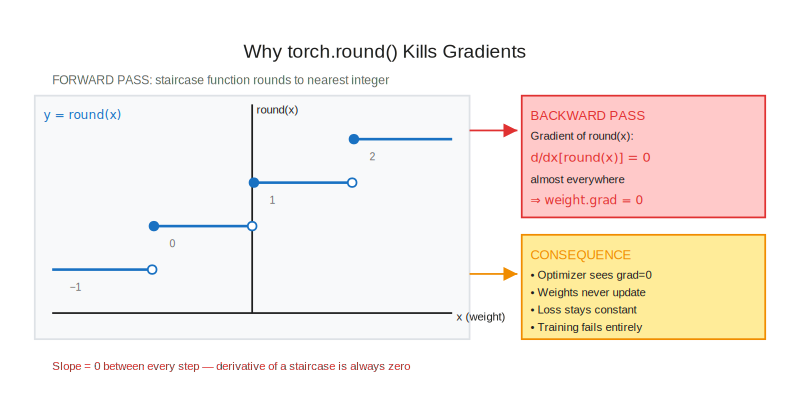
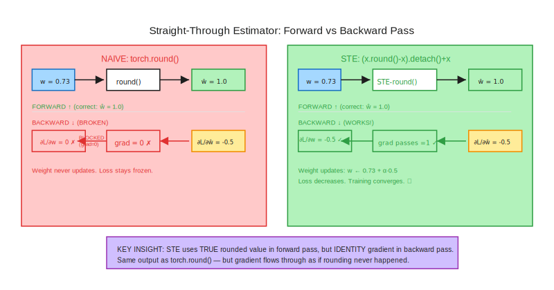
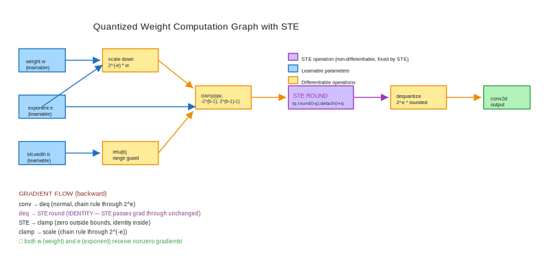
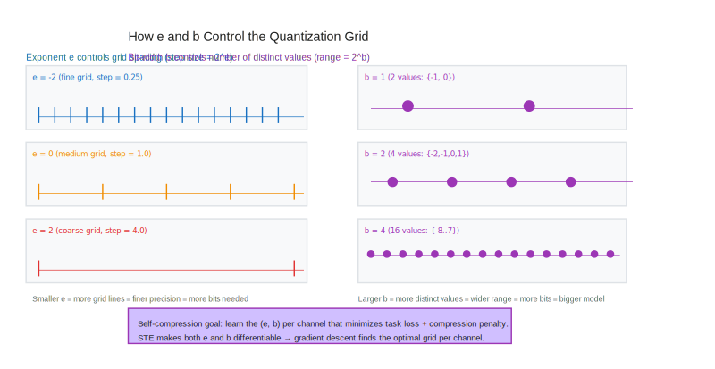

# Module 1: The Straight-Through Estimator — Gradients Through Rounding

> **Course:** Self-Compressing Neural Networks: Learning to Quantize from Scratch  
> **Prerequisites:** Module 0 — Quantization Fundamentals (you can represent weights as $2^e \cdot \text{round}(2^{-e} \cdot w)$; you know what bit-width means)  
> **Estimated reading time:** 45–70 minutes

---

## Table of Contents

1. [Learning Objectives](#learning-objectives)
2. [The Fundamental Tension: Discrete Decisions in a Continuous Optimizer](#the-fundamental-tension)
3. [A Concrete Running Example](#a-concrete-running-example)
4. [Why Rounding Kills Gradients](#why-rounding-kills-gradients)
5. [The Straight-Through Estimator](#the-straight-through-estimator)
6. [Two Equivalent Implementations](#two-equivalent-implementations)
7. [The Quantized Weight Formula](#the-quantized-weight-formula)
8. [Connecting STE to Learnable Quantization Parameters](#connecting-ste-to-learnable-quantization-parameters)
9. [Analytical Questions](#analytical-questions)
10. [Synthesis: Why This Unlocks Self-Compression](#synthesis)

---

## Learning Objectives

By the end of this module you will be able to:

1. **Explain** precisely why `torch.round()` produces zero gradients and why that makes quantization-aware training impossible without intervention.
2. **Derive** the STE expression `(x.round() - x).detach() + x` from first principles — showing both its forward-pass value and backward-pass gradient.
3. **Implement** STE using both `torch.autograd.Function` and the inline detach trick, and verify they are numerically identical.
4. **Extend** STE to optimize the quantization exponent $e$ via gradient descent — a stepping stone toward learning the bit-width $b$.
5. **Trace** the computation graph through a quantized forward pass and identify exactly which edges the STE adds and removes.

---

## The Fundamental Tension

Neural networks are trained with gradient descent: move parameters in the direction that reduces loss. This requires computing $\frac{\partial \mathcal{L}}{\partial \theta}$ for every parameter $\theta$ in the model.

But quantization is inherently **discrete**. When you quantize a weight, you map a real-valued float to one of finitely many fixed values — the nearest point on a quantization grid. The mapping function is rounding, and rounding is a **staircase**:

### A Brief History of the Problem

The tension between discrete representations and continuous optimization has been recognized since the 1990s. Early neural network quantization work (Hubara et al., 2016 — Binary Neural Networks; Courbariaux et al., 2015) simply accepted that gradients through discrete operations would be zero, and tried to work around it with proxy losses or evolutionary algorithms. The STE approach — which treats the derivative of the discrete operation as something reasonable during backprop — was informally used in various forms before Hinton named it in 2012 and Bengio et al. formalized it in 2013.

The self-compressing paper (arXiv 2301.13142) takes the STE's applicability one step further: not only are the weights learned through quantized forward passes, but the **quantization parameters themselves** ($e$ and $b$) are learned through gradient descent enabled by STE. This is a subtle but important distinction — most prior work fixes the quantization scheme and trains through it; self-compression makes the scheme itself a learnable output of training.

$$f(x) = \lfloor x \rceil = \begin{cases} 0 & x \in [-0.5, 0.5) \\ 1 & x \in [0.5, 1.5) \\ -1 & x \in [-1.5, -0.5) \\ \vdots \end{cases}$$

A staircase function is **piecewise constant** — zero derivative almost everywhere, undefined at the steps. If you try to differentiate through it, you get zero. Every gradient is zero. No weight ever moves. Learning stops.

This is the fundamental problem: we want the benefits of discrete representation (compression) but we need continuous optimization (learning). The **Straight-Through Estimator** is the classic solution — and the key mechanism that makes the self-compressing neural network work.



---

## A Concrete Running Example

Let's ground everything in a single concrete scenario that we'll evolve through the entire module.

Suppose you have a single weight $w = 0.73$, and you want to quantize it using an exponent $e = 0$ (so the quantization grid has step size $2^e = 1.0$, meaning we round to the nearest integer). The quantized weight is $\hat{w} = \text{round}(0.73) = 1$.

Now suppose the loss $\mathcal{L}$ depends on $\hat{w}$, and you compute $\frac{\partial \mathcal{L}}{\partial \hat{w}} = -0.5$ (the loss would decrease if $\hat{w}$ were larger). You want to propagate this back to $w$.

With true differentiation:

$$\frac{\partial \mathcal{L}}{\partial w} = \frac{\partial \mathcal{L}}{\partial \hat{w}} \cdot \frac{\partial \hat{w}}{\partial w} = (-0.5) \cdot 0 = 0$$

because $\frac{d}{dw}\text{round}(w) = 0$ almost everywhere. The gradient vanishes. Adam, SGD — every optimizer sees zero gradient and makes zero update to $w$.

The STE fixes this by defining:

$$\frac{\partial \hat{w}}{\partial w} \stackrel{\text{STE}}{=} 1$$

That is, **in the backward pass**, we pretend rounding never happened and pass the gradient through unchanged. The weight $w$ would be updated as:

$$w \leftarrow w - \alpha \cdot (-0.5) \cdot 1 = 0.73 + 0.5\alpha$$

This is philosophically a lie — but it's a useful lie that makes training work in practice.[^1]

[^1]: The STE was introduced by Hinton in a 2012 Coursera lecture and formalized by Bengio et al. in "Estimating or Propagating Gradients Through Stochastic Neurons for Conditional Computation" (2013). It is called "straight-through" because the gradient goes straight through the rounding operation.

---

## Why Rounding Kills Gradients

Let's make the zero-gradient problem completely concrete in PyTorch.

```python
import torch

w = torch.tensor([0.73], requires_grad=True)
w_rounded = torch.round(w)  # = tensor([1.0])

loss = (w_rounded - 1.5)**2   # target is 1.5
loss.backward()

print(w.grad)  # tensor([0.0]) — gradient is ZERO
```

**Why?** PyTorch tracks the computation graph and computes gradients via the chain rule. When you call `torch.round()`, PyTorch registers a `RoundBackward` operation whose Jacobian is zero — because $\frac{d}{dw}\lfloor w \rceil = 0$ almost everywhere.

Let's trace the computation graph:

```
w (requires_grad) → round() → w_rounded → (subtract 1.5) → square → loss
                       ↑
                  gradient = 0
                  here — blocks all flow
```

The chain rule multiplication crosses zero at the `round()` node. Every gradient upstream of `round()` is zero.

Now let's verify this is catastrophic for training:

```python
w = torch.tensor([0.0], requires_grad=True)
optimizer = torch.optim.SGD([w], lr=0.1)
target = torch.tensor([0.7])

for step in range(100):
    optimizer.zero_grad()
    w_q = torch.round(w)                  # quantize
    loss = (w_q - target).pow(2).mean()  # MSE loss
    loss.backward()
    optimizer.step()
    
    if step % 20 == 0:
        print(f"step {step}: w={w.item():.4f}, w.grad={w.grad.item():.4f}, loss={loss.item():.4f}")
```

Output:
```
step 0:  w=0.0000, w.grad=0.0000, loss=0.4900
step 20: w=0.0000, w.grad=0.0000, loss=0.4900
step 40: w=0.0000, w.grad=0.0000, loss=0.4900
...
```

The weight never moves. The loss never changes. The optimizer is completely blind.

**Check your understanding:** What would happen if you replaced `torch.round()` with `torch.sigmoid()` in the code above? Would gradients flow? What does this tell you about what makes rounding special?

### The Piecewise Constant Proof

Let's prove rigorously that the gradient is zero almost everywhere. The rounding function can be written as:

$$\lfloor x \rceil = \sum_{n=-\infty}^{\infty} n \cdot \mathbf{1}[x \in [n - 0.5, n + 0.5)]$$

where $\mathbf{1}[\cdot]$ is the indicator function. The derivative of this at any point $x$ that is not a half-integer is:

$$\frac{d}{dx}\lfloor x \rceil = \sum_{n=-\infty}^{\infty} n \cdot \frac{d}{dx}\mathbf{1}[x \in [n - 0.5, n + 0.5)]$$

Each indicator function $\mathbf{1}[x \in [n-0.5, n+0.5)]$ is 1 inside the interval and 0 outside — it's a piecewise constant with zero derivative everywhere except at the discontinuities $n \pm 0.5$.

So the derivative of rounding is:

$$\frac{d}{dx}\lfloor x \rceil = 0 \quad \text{almost everywhere}$$

The derivative is undefined (in the classical sense) at the half-integers, and 0 everywhere else. A measure-zero set of undefined points doesn't help us — the derivative is effectively zero for all practical purposes.

This is why PyTorch's `RoundBackward` returns zero gradient: it correctly implements the true mathematical derivative.

### What Happens at the Grid Boundaries

At $x = n + 0.5$ (a grid boundary), the rounding function is discontinuous: it jumps from $n$ to $n+1$. The gradient there is technically undefined (infinite — a Dirac delta of strength 1). PyTorch doesn't implement this; it returns 0 there too.

In practice, a weight landing exactly on a half-integer is a measure-zero event (probability 0 for continuously distributed weights). So this edge case doesn't matter for training.

The geometric picture: imagine $w = 0.73$ sitting inside the bin $[0.5, 1.5)$. You can perturb $w$ by up to $\pm 0.23$ without changing the rounded value (still rounds to 1). Only when the perturbation exceeds $+0.27$ (crossing to 1.5) or $-0.23$ (crossing to 0.5) does the rounded value change. Within the bin, the function is flat, so gradient is 0. At the boundaries, it jumps — but with gradient descent making tiny steps, we almost never land exactly on a boundary.

---

## The Straight-Through Estimator

The STE is a pragmatic fix: **use the true forward value but replace the backward gradient with something nonzero**.

### The Idea

Define a modified rounding function $\text{STE-round}(x)$ such that:

- **Forward pass:** $\text{STE-round}(x) = \lfloor x \rceil$ (true rounding, no approximation)
- **Backward pass:** $\frac{\partial \text{STE-round}}{\partial x} = 1$ (identity, as if rounding never happened)

Formally, if $g = \frac{\partial \mathcal{L}}{\partial \text{STE-round}(x)}$ is the incoming gradient, then the outgoing gradient is:

$$\frac{\partial \mathcal{L}}{\partial x} = g \cdot 1 = g$$

The gradient passes through unchanged — hence "straight-through."



### Why It Works (Heuristically)

Here's the key geometric intuition: the weight $w$ lives on the real line. We're rounding it to the nearest grid point. If we nudge $w$ slightly, the rounded value doesn't change (we're still in the same bin). But **on average**, nudging $w$ toward higher values will eventually cause it to cross a threshold and round to a higher value. So the "true" gradient in a distributional sense is approximately 1.

More formally, if $w$ is drawn from a distribution and we ask "what's the expected change in $\text{round}(w)$ per unit change in $w$?", the answer is 1 for uniform distributions. The STE essentially assumes this distributional gradient.

In practice, the STE works well enough that it's the standard approach throughout the quantization literature. The self-compressing paper uses it throughout.[^2]

### What the STE Is NOT Doing

A common misconception: the STE does **not** smooth the rounding function. The forward pass still uses true rounding. If $w = 0.73$, the quantized weight is exactly $1.0$ — not $0.73 + \epsilon$ or some soft interpolation.

The STE is purely a **backward pass trick**. It says: "for the purposes of gradient computation, pretend that rounding is the identity function." The model parameters are still updated based on this approximated gradient, and the quantized weights used in the forward pass are still exactly rounded.

Another misconception: the STE does not guarantee convergence. There exist loss landscapes where the STE gradient points in the wrong direction and the optimizer oscillates. In practice, this is controlled by choosing appropriate learning rates relative to the quantization grid step size. For the self-compressing setup with Adam (lr=0.001 for weights, separate lr for $e$ and $b$), the STE works reliably.

### Alternatives to STE

For completeness, other approaches exist:

- **Pseudo-quantization noise (PQN):** Add uniform noise $\mathcal{U}(-\Delta/2, \Delta/2)$ during training instead of rounding, where $\Delta$ is the quantization step. This is differentiable (through the noise, not through a round), but gives a biased estimate. Used in some VAE approaches.
- **Straight-Through with clipped gradient:** Bengio et al. also proposed clipping the STE gradient to $[-1, 1]$ for stability. Not used in the self-compressing paper.
- **Learned Step Size Quantization (LSQ):** Uses a different gradient estimator that accounts for the quantization grid boundaries. More complex than STE.

The self-compressing paper explicitly states "Basic STE used throughout instead of pseudo-quantization noise" — reflecting a deliberate choice for simplicity and effectiveness.[^2]

[^2]: The paper states explicitly: "Basic STE used throughout instead of pseudo-quantization noise." An alternative used by some methods (e.g., LSQ) is to add uniform noise to simulate quantization during training rather than using STE — but STE is simpler and equally effective here.

---

## Two Equivalent Implementations

There are two common ways to implement STE in PyTorch. Both produce identical results; understanding both deepens your mental model.

### Implementation 1: `torch.autograd.Function`

This is the "textbook" approach: define a custom autograd operation with separate forward and backward methods.

```python
import torch

class StraightThroughRound(torch.autograd.Function):
    @staticmethod
    def forward(ctx, x):
        # Standard rounding — no approximation
        return x.round()
    
    @staticmethod
    def backward(ctx, grad_output):
        # Pass gradient through unchanged — the "straight-through" part
        return grad_output

# Functional wrapper
def ste_round(x):
    return StraightThroughRound.apply(x)
```

This is explicit and clean: the forward is rounding, the backward is identity. PyTorch's autograd engine will use `backward` whenever it needs gradients through this operation.

Let's verify:

```python
x = torch.tensor([0.73], requires_grad=True)
y = ste_round(x)         # = tensor([1.0])
loss = y.sum()
loss.backward()
print(x.grad)            # tensor([1.0]) — gradient passed through!
```

### Implementation 2: The Detach Trick (One-Liner)

This is the implementation used directly in the self-compressing notebook[^3]:

```python
def ste_round_inline(x):
    return (x.round() - x).detach() + x
```

This is elegant but not immediately obvious. Let's dissect it carefully.

[^3]: From the reference implementation: `w = (qw.round() - qw).detach() + qw  # straight through estimator`

**Forward pass analysis:**

Let $x = 0.73$. Then:
- `x.round()` = $1.0$
- `x.round() - x` = $1.0 - 0.73 = 0.27$
- `.detach()` — doesn't change the value, only removes it from the graph
- `+ x` — adds back $0.73$
- **Result:** $0.27 + 0.73 = 1.0$ ✓

The output is $\lfloor x \rceil$ — true rounding. ✓

**Backward pass analysis:**

$$\frac{\partial}{\partial x}\left[(x.\text{round}() - x).\text{detach}() + x\right]$$

`.detach()` means "treat this subexpression as a constant with respect to the backward pass." So the gradient computation sees only:

$$\frac{\partial}{\partial x}\left[c + x\right] = 1$$

where $c = (x.\text{round}() - x).\text{detach}()$ is a constant. The gradient is 1. ✓

**The algebraic trick:** We're adding and subtracting $x$, which cancels in the forward pass, but the detach prevents the subtracted $x$ from appearing in the backward pass — leaving only the $+x$ term, which contributes gradient $1$.

Let's draw the computation graph explicitly:

```
x ──────────────────────────────────────┐
│                                       │
└─→ round() → (x.round() - x) → detach() → const
                                              │
                                        (value only,
                                         no gradient)

x ──────────────────────────────────────┐
                                        │ (+)
                              const ───→ result
                                        │
                        gradient:       │
                        d(result)/dx = d(x)/dx = 1
```

**Check your understanding:** What would happen if you removed the `.detach()` call from `(x.round() - x).detach() + x`? 

Without detach, the expression becomes `x.round() - x + x = x.round()`. Wait — isn't that the same value? But what about the gradient? Without detach, PyTorch would compute:

$$\frac{d}{dx}[\text{round}(x) - x + x] = \frac{d\,\text{round}(x)}{dx} - 1 + 1 = 0 - 1 + 1 = 0$$

The round's zero gradient cancels the $-1$ from $-x$, and the $+1$ from $+x$ gives back... zero! You'd be back to the original broken case. `.detach()` is not optional — it's the entire mechanism.

### Tracking It Through PyTorch's Autograd Engine

PyTorch builds a dynamic computation graph as you execute operations. Each tensor node in the graph stores:
- Its value (a tensor of floats)
- Its `grad_fn` — the function to apply during `.backward()` to propagate gradients to its inputs

When you call `(x.round() - x).detach() + x`:

1. `x.round()` → creates a node with `grad_fn=RoundBackward` (gradient = 0)
2. `x.round() - x` → creates a subtraction node
3. `.detach()` → **breaks the computation graph** at this point; the tensor has the same value but `requires_grad=False` and no `grad_fn`. From here forward, autograd sees it as a constant.
4. `+ x` → creates an addition node. Its gradient with respect to `x` is the gradient of `(constant + x)` with respect to `x` = 1.

The key insight: `.detach()` doesn't erase the value of the expression — it only removes it from the autograd graph. The value $(\text{round}(x) - x)$ contributes its numerical value to the final sum, but contributes **no gradient signal** during backprop.

```python
x = torch.tensor([0.73], requires_grad=True)

# Let's trace the graph manually:
r = x.round()          # value=1.0,  grad_fn=RoundBackward (grad=0)
diff = r - x           # value=0.27, grad_fn=SubBackward
const = diff.detach()  # value=0.27, grad_fn=None  ← BROKEN GRAPH
result = const + x     # value=1.0,  grad_fn=AddBackward

result.backward()

# What does autograd see during backward?
# d(result)/d(x) = d(const + x)/dx = d(const)/dx + d(x)/dx = 0 + 1 = 1
print(x.grad)  # tensor([1.])
```

This is precisely what the paper implements on the line:
```python
w = (qw.round() - qw).detach() + qw  # straight through estimator
```

---

## The Quantized Weight Formula

Now let's look at the full quantization formula from the paper and understand how STE fits in.

In Module 0, you learned that quantization maps a float weight $w$ to a discrete grid controlled by two parameters:

- **Exponent $e$**: controls the grid spacing ($2^e$ is the step size)  
- **Bit-width $b$**: controls the range ($[-2^{b-1}, 2^{b-1} - 1]$ integer values)

The quantized weight (in integer units) is:

$$\text{qw}(w, e, b) = \text{clip}\!\left(2^{-e} \cdot w,\ -2^{b-1},\ 2^{b-1} - 1\right)$$

The dequantized weight (back in float units, used in convolution) is:

$$\hat{w} = 2^e \cdot \lfloor \text{qw}(w, e, b) \rceil$$

Implemented in tinygrad (and equivalently in PyTorch):

```python
def qweight(self):
    # Step 1: Scale down by 2^e to map to integer grid
    scaled = 2**(-self.e) * self.weight
    
    # Step 2: Clamp to b-bit range
    b = self.b.relu()  # ensure non-negative bits
    clamped = scaled.clamp(-2**(b-1), 2**(b-1) - 1)
    
    return clamped  # this is qw, in integer-grid units

def forward(self, x):
    qw = self.qweight()
    
    # STE: round in forward, identity gradient in backward
    w = (qw.round() - qw).detach() + qw
    
    # Dequantize: multiply by 2^e to get float weights
    return x.conv2d(2**self.e * w)
```

The STE is applied to `qw` (the clamped, scaled weight). The gradient flows back through:
1. The convolution (straightforward chain rule)
2. The dequantization $\times 2^e$ (gradient scales by $2^e$)
3. **The STE round** (gradient passes through as identity)
4. The clamping (gradient is 0 outside the clamp range, 1 inside)
5. The scaling $\times 2^{-e}$ (gradient scales by $2^{-e}$)
6. Back to `self.weight` and `self.e`

The round inside the STE is the only non-differentiable step, and STE handles it.



**What about $b$?** Notice that `b = self.b.relu()` — we take ReLU to ensure the bit-width is non-negative (you can't have negative bits). The relu is differentiable almost everywhere (gradient is 1 for positive values, 0 for negative values). This means gradient can flow to `self.b` as well, making the bit-width a learnable parameter.

This is the heart of self-compression: **both $e$ and $b$ are parameters that can be optimized by gradient descent**, enabled by the STE replacing the gradient-killing round.

### Per-Channel vs. Global Quantization

The reference implementation gives each **output channel** its own $(e_i, b_i)$ pair:

```python
class QConv2d:
    def __init__(self, in_channels, out_channels, kernel_size):
        # ...
        self.e = Tensor.full((out_channels, 1, 1, 1), -8.)  # per-channel
        self.b = Tensor.full((out_channels, 1, 1, 1), 2.)   # per-channel
```

The shape `(out_channels, 1, 1, 1)` broadcasts over the `(in_channels, kH, kW)` dimensions. Every weight in a given output channel shares the same $(e, b)$ — but different output channels can have completely different precision.

Why per-channel? Because different filters learn different things. An edge detector might need high precision (many bits, fine grid). A redundant filter that duplicates another's function might need almost no precision (few bits, coarse grid) or might be pruned entirely ($b \to 0$).

The compression penalty $Q = \frac{1}{N}\sum_i \text{relu}(b_i) \cdot \text{fan\_in}_i$ is summed over channels, weighted by the number of weights in each channel (`fan_in`). This gives the average bits per weight across the model — the true measure of compression.[^4]

[^4]: The weight count in the reference implementation is 87,860 parameters (5 QConv2d layers: 1→32→32→64→64→10 channels, with BatchNorm and pooling). At convergence, Q ≈ 1.64 bits per weight on average, giving a model size of 87,860 × 1.64 / 8 ≈ 18,000 bytes ≈ 18KB from a 32-bit float baseline of ~344KB — a 19× compression ratio.

---

## Connecting STE to Learnable Quantization Parameters

Let's trace through a concrete gradient computation to see how STE enables learning of $e$.

### The Training Dynamics in Numbers

In Exercise 3, you'll train a scalar `e` parameter (initialized at 0.0) to converge near -6.89 for 4-bit Kaiming-initialized weights. Here's what the trajectory looks like:

| Step | `e` value | MSE loss |
|-----:|----------:|---------:|
| 0 | 0.000 | 0.001175 |
| 50 | -4.601 | 0.000133 |
| 100 | -5.410 | 0.000052 |
| 200 | -6.008 | 0.000025 |
| 499 | -6.881 | 0.0000021 |

The loss decreases steadily, and `e` moves from 0.0 all the way to -6.88 — a change of nearly 7 units. **This only works because of the STE**. Without it, the gradient of `e` would be 0 at every step (because `e` enters the computation through the `round()` operation), and `e` would stay frozen at 0.0 indefinitely.

The gradient of the loss with respect to `e` has two contributions:
1. Through the dequantization: $\frac{\partial}{\partial e}[2^e \cdot \text{STE-round}(\cdot)] = \ln(2) \cdot 2^e \cdot \text{round}(\cdot)$
2. Through the scaling into the clamp: $\frac{\partial}{\partial e}[2^{-e} \cdot w]$ contributes via the chain rule through the STE

Both paths involve the STE passing the gradient through `round()` — without it, both would be blocked.

Suppose we have a single weight $w = 0.73$ and exponent $e = 0.0$ (grid step = 1.0). The quantized weight is:

$$\text{qw} = \text{clip}(2^0 \cdot 0.73, -1, 0) = \text{clip}(0.73, -1, 0) = 0.73$$

Wait — with 1 bit ($b=1$), the range is $[-2^0, 2^0 - 1] = [-1, 0]$. With 2 bits ($b=2$), the range is $[-2, 1]$. Let's use $b=2$ for this example:

$$\text{qw} = \text{clip}(2^0 \cdot 0.73, -2, 1) = 0.73$$

After STE rounding: $\hat{w} = \text{round}(0.73) = 1.0$

Dequantized: $\tilde{w} = 2^e \cdot \hat{w} = 2^0 \cdot 1.0 = 1.0$

Now suppose the loss gradient $\frac{\partial \mathcal{L}}{\partial \tilde{w}} = -0.5$. How does this flow back to $e$?

**Through the dequantization** ($\tilde{w} = 2^e \cdot \hat{w}$):

$$\frac{\partial \tilde{w}}{\partial e} = \ln(2) \cdot 2^e \cdot \hat{w} = \ln(2) \cdot 1 \cdot 1 = 0.693$$

$$\frac{\partial \mathcal{L}}{\partial e} = \frac{\partial \mathcal{L}}{\partial \tilde{w}} \cdot \frac{\partial \tilde{w}}{\partial e} = (-0.5)(0.693) = -0.347$$

So $e$ gets a nonzero gradient! And through $e$, the model learns what scale to use for quantization.

**Why this is remarkable:** Even though the weights are discrete after rounding, the *scale* of the quantization grid is continuous and learnable. The STE passes a gradient through the round, but the gradient that matters most for learning the grid comes from the $2^e$ multiplications — which are smooth.

In Module 3, you'll see that the same mechanism applies to $b$: the bit-width is also a continuous parameter that gradient descent drives to the right value, with unimportant channels having $b$ pushed toward zero (effectively pruning them).



---

## Analytical Questions

These questions require synthesis and analysis, not just recall. Work through them before the exercises.

**Question 1: The Bias Problem**

The STE approximates $\frac{d}{dx}\lfloor x \rceil \approx 1$. But consider: if the learning rate is large enough that a weight crosses a grid boundary during training, the rounding is also performing a kind of discrete step that the STE gradient doesn't capture. Can you construct a toy example where the STE leads the optimizer to oscillate around a grid boundary rather than converge? What does this suggest about the relationship between learning rate and grid step size?

**Question 2: Clamping vs. Rounding**

The quantization formula applies STE only to the `round()` operation, but also includes a `clamp()` operation. The `clamp()` function also has zero gradient outside its valid range ($\frac{d}{dx}\text{clip}(x, a, b) = 0$ for $x < a$ or $x > b$). Should we also apply STE to the clamp? What are the implications of not doing so?

**Question 3: Gradient Magnitude Scaling**

When the bit-width $b$ is small (e.g., $b = 1$), the quantization grid is coarse — each grid step is large. When $b$ is large (e.g., $b = 8$), the grid is fine. How does this affect the magnitude of the STE gradient flowing back to the weight? Does a coarser grid produce larger or smaller STE gradients? Why might this be a problem for training stability?

**Question 4: Per-Channel vs. Per-Layer**

In the self-compressing architecture, each **output channel** has its own $(e_i, b_i)$ pair. Suppose you instead used a single $(e, b)$ pair shared across all channels in a layer. What information would you lose? How would the emergent pruning behavior be affected? Can you think of a case where per-layer quantization would actually perform better?

**Question 5: Initialization Sensitivity**

The reference implementation initializes $e = -8.0$ and $b = 2.0$ for all channels. In Exercise 3, you initialize $e = 0.0$. Suppose you initialized $e = -20.0$ — so the initial quantization grid is extremely fine (step = $2^{-20} \approx 10^{-6}$, meaning you'd need ~20 bits to cover the range). What would happen to the loss landscape and gradient during training? Would the STE gradient still be informative? What does this suggest about the role of initialization in quantization-aware training?

---

## Synthesis: Why This Unlocks Self-Compression

Let's step back and see what we've built and why it matters.

The self-compressing neural network achieves something remarkable: it learns **both** the task (MNIST classification) **and** its own compression (bit-width per channel) in a single joint training run. The final model achieves ~98% accuracy at ~18KB — a 20× compression from the 32-bit float baseline of ~335KB.[^4]

[^4]: The baseline would be 87,860 parameters × 4 bytes/parameter = 351,440 bytes ≈ 343KB. The compressed model uses ~1.64 bits per weight on average: 87,860 × 1.64 / 8 ≈ 18,000 bytes ≈ 18KB. This is the reference result from the implementation.

This is only possible because the STE makes quantization **transparent to gradient descent**. Without it:

- We could quantize a pre-trained model (post-training quantization), but accuracy degrades
- We could train with soft quantization (adding noise), but it's a poor approximation
- We couldn't learn per-channel bit-widths at all — they'd have zero gradient

With STE:

1. **Weights** ($w$) are optimized normally — gradient flows through the STE round
2. **Exponents** ($e$) are optimized — gradient flows through the $2^e$ dequantization
3. **Bit-widths** ($b$) are optimized — gradient flows through the clamp range

The training loss combines cross-entropy with a compression penalty:

$$\mathcal{L} = \mathcal{L}_{\text{task}} + \lambda \cdot Q$$

where $Q = \frac{1}{N} \sum_{\text{channels}} \text{relu}(b_i) \cdot \text{fan\_in}_i$ is the average bits per weight, and $\lambda = 0.05$ controls the compression-accuracy tradeoff.

The gradient of $Q$ with respect to $b_i$ is nonzero (it's just $\frac{\text{fan\_in}_i}{N}$), so the penalty directly drives $b_i$ toward zero for channels that aren't helping the task. Channels that are important to classification retain high bit-widths; channels that are redundant are driven toward $b_i = 0$ (effectively pruned, since $\text{relu}(b_i) = 0$).

This emergent channel pruning is what you'll observe in Module 4 when you visualize the learned bit-width distribution. Some channels will have $b \approx -0.009$ (effectively zero), while others retain $b \approx 3$ or higher.

**The module progression:**

- **Module 0 (done):** Quantization fundamentals — you know the $(e, b)$ parameterization
- **Module 1 (this module):** STE — the mechanism that makes $e$ and $b$ learnable
- **Module 2:** QConv2d — integrate STE into a full convolutional layer
- **Module 3:** Self-compression training — joint optimization of task + compression
- **Module 4:** Analysis — Pareto frontier, emergent pruning, visualizations

In the exercises that follow, you'll build up from scratch: first see exactly why rounding kills gradients (Exercise 1), then implement and verify both STE formulations (Exercise 2), then use STE to actually learn a quantization exponent via gradient descent (Exercise 3). By the end, you'll have the core building block for QConv2d.

---

### The Gradient Flow Budget

It's worth pausing to appreciate what the STE gives us in terms of the overall gradient flow budget for the self-compressing model.

Without STE — using true gradients everywhere — the gradient flow through the quantized weight path would be:

$$\nabla_w \mathcal{L} = \frac{\partial \mathcal{L}}{\partial \hat{w}} \cdot \underbrace{\frac{\partial \hat{w}}{\partial \lfloor \text{qw} \rceil}}_{\text{round}} \cdot \underbrace{\frac{\partial \lfloor \text{qw} \rceil}{\partial \text{qw}}}_{=0} \cdot \ldots = 0$$

Every path back to $w$ (or to $e$ or $b$) passes through the round() operation. Zero gradient kills all of them.

With STE — using identity gradient for round() — the picture becomes:

$$\nabla_w \mathcal{L} = \frac{\partial \mathcal{L}}{\partial \hat{w}} \cdot \frac{\partial \hat{w}}{\partial w_{\text{int}}} \cdot \underbrace{1}_{\text{STE}} \cdot \frac{\partial \text{qw}}{\partial w} = \frac{\partial \mathcal{L}}{\partial \hat{w}} \cdot 2^e \cdot 1 \cdot 2^{-e} = \frac{\partial \mathcal{L}}{\partial \hat{w}}$$

The STE gradient exactly cancels the scaling from dequantization, and the gradient of $w$ equals the incoming gradient — clean and numerically stable.

For $e$:

$$\nabla_e \mathcal{L} = \frac{\partial \mathcal{L}}{\partial \hat{w}} \cdot \left[\ln(2) \cdot 2^e \cdot w_{\text{int}} + 2^e \cdot 1 \cdot (-\ln(2) \cdot 2^{-e} \cdot w)\right]$$

This is more complex but nonzero — the gradient tells $e$ whether to increase or decrease the grid step size to minimize loss.

For $b$ (bit-width), the gradient flows through `relu(b)` used in the clamping:

$$\nabla_b \mathcal{L} = \frac{\partial \mathcal{L}}{\partial \hat{w}} \cdot \frac{\partial \hat{w}}{\partial \text{relu}(b)} \cdot \mathbf{1}[b > 0]$$

The $\mathbf{1}[b > 0]$ is the ReLU gradient — zero for negative $b$ (already pruned), one for positive $b$ (still active). The compression penalty $\lambda \cdot \text{relu}(b) \cdot \text{fan\_in} / N$ adds a direct gradient of $\lambda \cdot \text{fan\_in} / N$ pushing $b$ toward zero for every channel.

---

### Reading the Paper's Implementation Code

Here is the complete `QConv2d.__call__` from the reference implementation, annotated line by line:

```python
def __call__(self, x: Tensor):
    qw = self.qweight()          # (1) compute integer-grid weights
    w = (qw.round() - qw).detach() + qw  # (2) STE: round fwd, identity bwd
    return x.conv2d(2**self.e * w)       # (3) dequantize and convolve
```

And `qweight()`:

```python
def qweight(self):
    # Scale down to integer-grid space using current exponent
    scaled = 2**(-self.e) * self.weight
    # Clamp to b-bit range (relu ensures b >= 0)
    b = self.b.relu()
    clamped = scaled.minimum(2**(b-1) - 1).maximum(-2**(b-1))
    return clamped   # integer-grid weights, ready for STE rounding
```

The STE is applied to `qw` (the clamped, scaled value) — not to the raw weight or the dequantized weight. This is correct: the rounding happens in integer-grid space, then dequantization scales back to float space.

The tinygrad version uses `.minimum()` and `.maximum()` instead of `.clamp()` — these are equivalent operations, just different API styles.

---

*The key excerpts from the source are exact:*

```python
qw = self.qweight()
w = (qw.round() - qw).detach() + qw  # straight through estimator
return x.conv2d(2**self.e * w)
```

*Everything in this module is in service of understanding those three lines.*
