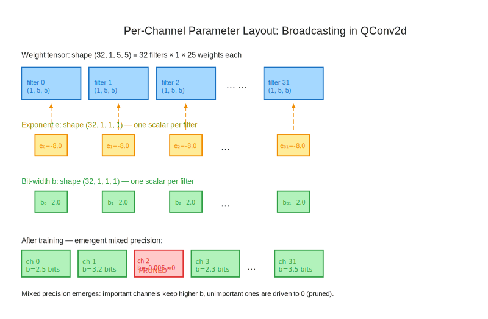
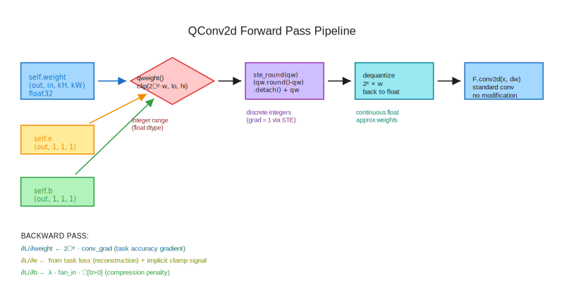
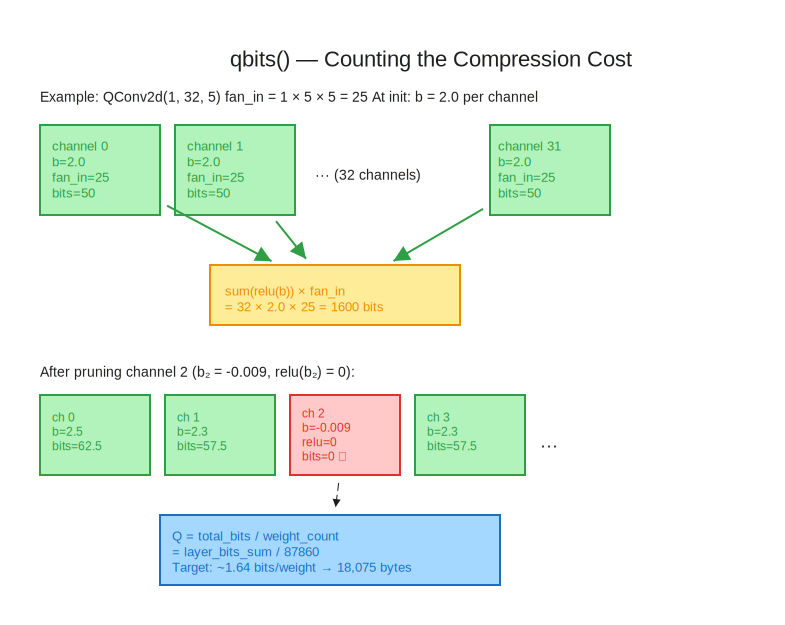

# Module 2: Building the QConv2d Layer — Learnable Quantization

**Course:** Self-Compressing Neural Networks: Learning to Quantize from Scratch  
**Prerequisites:** Module 0 (Quantization Fundamentals), Module 1 (Straight-Through Estimator)

---

## Table of Contents

1. [Learning Objectives](#learning-objectives)
2. [Running Example: A Single Quantized Convolution](#running-example)
3. [Why Per-Channel Parameters?](#why-per-channel)
4. [The Parameter Layout: Broadcasting Through Shape](#parameter-layout)
5. [The Quantized Weight Formula](#quantized-weight-formula)
6. [The Forward Pass: Quantize → STE → Dequantize → Convolve](#forward-pass)
7. [Counting Bits: The qbits() Method](#counting-bits)
8. [Measuring Model Size](#measuring-model-size)
9. [Gradient Flow: All Three Parameters Must Learn](#gradient-flow)
10. [The Complete QConv2d Implementation](#complete-implementation)
11. [Analytical Questions](#analytical-questions)
12. [Synthesis: The Module as a Compression Unit](#synthesis)

---

## Learning Objectives

By the end of this module you will be able to:

- Implement `QConv2d.__init__` with correctly shaped per-channel parameters `e` and `b`
- Derive and implement `qweight()` — the clamped, integer-valued quantized weight tensor
- Wire up the forward pass using the straight-through estimator for end-to-end differentiability
- Implement `qbits()` and understand *why* `relu(b)` is the right gate for learned pruning
- Compute model size in bytes from the average bits-per-weight statistic `Q`
- Verify that all three parameters (`weight`, `e`, `b`) receive nonzero gradients during training

These objectives culminate in exercise 4, where you verify that the gradient wiring is correct — without which self-compression is simply impossible.

---

## Running Example: A Single Quantized Convolution {#running-example}

Throughout this module, we will work with a single layer: `QConv2d(in_channels=1, out_channels=32, kernel_size=5)`. This is the first layer of the MNIST model we will train in Module 3.

The weight tensor for this layer has shape `(32, 1, 5, 5)` — 32 output channels, 1 input channel, 5×5 kernel. That is `32 × 1 × 5 × 5 = 800` scalar weights. At 32-bit float precision, that is `800 × 4 = 3,200` bytes.

After self-compression training, this layer might use an average of 2.5 bits per weight — `800 × 2.5 / 8 = 250` bytes. A 12.8× compression on the first layer alone.

The numbers we will derive in this module are all consistent with the reference result: **~18,075 bytes** total model size from **87,860** original parameters — roughly 1.64 bits per weight, a **~20× compression** from 32-bit floats.

We will track this example layer through every formula and code snippet.

---

## Why Per-Channel Parameters? {#why-per-channel}

In Module 0 we established that quantization maps continuous floats to a discrete grid. The key design choice in any quantization scheme is *what* shares a quantization grid and *what* gets its own.

**Uniform quantization** (the naive approach) assigns a single scale and bit-width to all weights in a network. Every weight gets quantized the same way. This is easy to implement but wastes precision: some layers might need more bits for accuracy, others could get away with fewer.

**Per-layer quantization** assigns separate parameters to each layer. Better, but still coarse — the first conv layer might have some filters that are critical (high activation variance, large gradients) and others that are nearly inert.

**Per-channel quantization** is the approach taken by the Self-Compressing Neural Networks paper. Each *output channel* of each convolutional layer gets its own pair of parameters:

- $e_i$ — the **exponent** (controls scale / resolution of the quantization grid)
- $b_i$ — the **bit-width** (controls the range / number of distinct representable values)

This is the granularity at which the network learns what precision it needs. In our 32-channel example layer, that means 32 independent $(e_i, b_i)$ pairs — one per output filter.

**Why output channels specifically?** Output channels are the unit of redundancy in convolutional networks. Pruning research consistently shows that channels (not individual weights) are the right unit for structured compression — removing an entire channel removes a row from the weight matrix, keeps the computation graph intact, and produces a strictly smaller network. Self-compression arrives at the same conclusion organically: when a channel's `b_i` is driven to zero by the compression penalty, that channel is effectively pruned.[^1]

[^1]: The paper calls this "emergent channel pruning" — the network discovers which channels are expendable without any explicit pruning algorithm. After training, some channels have `b ≈ -0.009`, which through `relu(b) = 0` contributes exactly zero bits. We see this clearly in the reference output: `layers.2.b [2.39, 2.32, 2.32, -0.009, -0.007, ...]` — four channels in the second conv layer are effectively pruned.

---

## The Parameter Layout: Broadcasting Through Shape {#parameter-layout}

The weight tensor of `QConv2d(1, 32, 5)` has shape:

$$W \in \mathbb{R}^{(32,\ 1,\ 5,\ 5)}$$

We need parameters $e$ and $b$ to be **per-channel** — one value per output channel. But we also need them to broadcast cleanly when we compute `e * W` (element-wise scaling).

The trick is to give `e` and `b` shape `(out_channels, 1, 1, 1)`:

$$e \in \mathbb{R}^{(32,\ 1,\ 1,\ 1)}, \quad b \in \mathbb{R}^{(32,\ 1,\ 1,\ 1)}$$

When PyTorch broadcasts `(32, 1, 1, 1)` against `(32, 1, 5, 5)`, it replicates the single value across all `1 × 5 × 5 = 25` weight positions in each channel. Channel `i`'s exponent $e_i$ applies uniformly to all 25 weights in that filter.



In code:

```python
self.e = nn.Parameter(torch.full((out_channels, 1, 1, 1), -8.0))
self.b = nn.Parameter(torch.full((out_channels, 1, 1, 1), 2.0))
```

**Initialization choices matter here.** The reference sets `e = -8.0` and `b = 2.0`:

- `b = 2.0` means we start with 2 bits per weight — a very aggressive starting point. The network will learn whether to *increase* precision (raise `b`) for important channels or *decrease* it (lower `b`) for unimportant ones.
- `e = -8.0` means the initial scale factor is $2^{-(-8)} = 2^8 = 256$. So the initial quantization grid has resolution $2^e = 2^{-8} = 1/256$. This is fine-grained enough that a 2-bit quantizer can represent weights in a reasonable range.[^2]

[^2]: With `e = -8.0` and `b = 2.0`, the initial quantized integers are in $[-2, 1]$, and dequantized weights are in $[-2 \cdot 2^{-8},\ 1 \cdot 2^{-8}] = [-1/128,\ 1/256]$. This overlaps with Kaiming uniform initialization for `(1, 32, 5, 5)`, which initializes weights in $\pm 1/\sqrt{25} \approx \pm 0.2$. The quantization grid will quickly adapt during training as `e` learns.

**Check your understanding:** What shape would `e` need to be for *per-weight* quantization (each scalar weight has its own exponent)? What about *per-layer* quantization? Which extreme produces the most flexible model? Which is computationally cheapest?

---

## The Quantized Weight Formula {#quantized-weight-formula}

This is the core computation of the entire paper. Let's derive it step by step.

### Step 1: The Effective Bit-Width

We cannot allow negative bit-widths — that's physically meaningless. But during gradient descent, `b` can drift below zero. We gate it:

$$b_{\text{eff},i} = \text{ReLU}(b_i) = \max(0, b_i)$$

This is a smooth, differentiable function that clamps the *effective* bit-width at zero. When $b_i < 0$, we have $b_{\text{eff},i} = 0$ and the channel contributes zero bits — it is pruned.

### Step 2: The Quantization Bounds

A signed integer with $b_{\text{eff}}$ bits can represent values in:

$$\left[-2^{b_{\text{eff}}-1},\ \ 2^{b_{\text{eff}}-1} - 1\right]$$

For example, with `b_eff = 2.0`:
- Lower bound: $-2^{2-1} = -2^1 = -2$
- Upper bound: $2^{2-1} - 1 = 2 - 1 = 1$

So 2-bit signed integers represent $\{-2, -1, 0, 1\}$ — four distinct values, as expected.

With `b_eff = 3.0`:
- Lower: $-4$, Upper: $3$ → $\{-4, -3, -2, -1, 0, 1, 2, 3\}$ — eight values.

Note the asymmetry: the lower bound is more negative by one. This is standard two's-complement signed integer convention.[^3]

[^3]: In 8-bit two's complement, the range is $[-128, 127]$, not $[-128, 128]$. The asymmetry exists because zero occupies one slot in the positive range. Self-compression inherits this convention directly, though in practice the slight asymmetry rarely matters for learned quantization.

### Step 3: Scaling the Weights

Before clamping, we scale the raw weights by $2^{-e_i}$:

$$\tilde{w}_{i,j} = 2^{-e_i} \cdot w_{i,j}$$

This maps continuous floating-point weights into the integer domain. The exponent $e_i$ controls the resolution: a large negative $e$ (like $-8$) means $2^{-e} = 256$, so weights are magnified by 256 before rounding — capturing very fine-grained differences. A large positive $e$ means coarse quantization.

### Step 4: Clamping to the Quantization Range

We clamp the scaled weights to the integer-representable range:

$$q_{i,j} = \text{clip}\!\left(2^{-e_i} \cdot w_{i,j},\ -2^{b_{\text{eff},i}-1},\ 2^{b_{\text{eff},i}-1} - 1\right)$$

In full notation, the complete `qweight` formula is:

$$\boxed{q_{i,j} = \min\!\left(\max\!\left(2^{-e_i} \cdot w_{i,j},\ -2^{b_{\text{eff},i}-1}\right),\ 2^{b_{\text{eff},i}-1} - 1\right)}$$

where $b_{\text{eff},i} = \text{ReLU}(b_i)$.

This is exactly the key excerpt from the reference implementation (translated from tinygrad to PyTorch):

```python
def qweight(self) -> torch.Tensor:
    eff_b = torch.relu(self.b)              # (out_ch, 1, 1, 1) — non-negative bits
    lower = -(2 ** (eff_b - 1))             # (out_ch, 1, 1, 1)
    upper =  (2 ** (eff_b - 1)) - 1        # (out_ch, 1, 1, 1)
    scaled = (2 ** (-self.e)) * self.weight # (out_ch, in_ch, kH, kW) — broadcast
    return torch.minimum(torch.maximum(scaled, lower), upper)
```

**Note:** We use `torch.minimum`/`torch.maximum` (element-wise) rather than `torch.clamp` (scalar bounds). This is essential because `lower` and `upper` have shape `(out_channels, 1, 1, 1)` — per-channel, not a single scalar.



### The Pruning Mechanism Emerges from the Math

What happens when $b_i \to 0^-$ (the channel is being driven toward pruning)?

- $b_{\text{eff},i} = \text{ReLU}(b_i) = 0$
- Lower bound: $-2^{0-1} = -2^{-1} = -0.5$
- Upper bound: $2^{0-1} - 1 = 0.5 - 1 = -0.5$
- So lower = upper = $-0.5$, and $q_{i,j} = -0.5$ for all $j$

After rounding (in the forward pass): $\text{round}(-0.5) = 0$ in Python/PyTorch's banker's rounding. The entire channel becomes zero. The channel is pruned.

As $b_i$ decreases further below zero, `relu(b_i)` stays at zero — the pruning is stable. The compression penalty keeps pushing `b_i` more negative, but the effective behavior doesn't change. This is elegant: pruning is a continuous limit of quantization.[^4]

[^4]: Technically, Python's `round(0.5)` uses banker's rounding (round half to even), so `round(-0.5)` could be `0` or `-1` depending on implementation. PyTorch's `torch.round` also uses banker's rounding. In practice the distinction is irrelevant because the weights are not exactly -0.5; they converge near that value and the gradient pushes them toward zero.

**Check your understanding:** What happens to `qweight()` if you forget the `relu()` on `b` and `b` drops to `-3.0`? Compute the lower and upper bounds. What does `torch.minimum(torch.maximum(scaled, lower), upper)` return when lower > upper?

---

## The Forward Pass: Quantize → STE → Dequantize → Convolve {#forward-pass}

The `forward` method chains four operations:

### Operation 1: Compute Quantized Weights
```python
qw = self.qweight()   # shape: (out_ch, in_ch, kH, kW), values in integer range
```

At this point, `qw` contains continuous floating-point values in the integer range $[-2^{b_{\text{eff}}-1}, 2^{b_{\text{eff}}-1}-1]$. They are *in* the integer range but not yet *rounded to* integers.

### Operation 2: Apply the Straight-Through Estimator

From Module 1, the STE trick is:

$$\text{ste\_round}(x) = (x.\text{round}() - x).\text{detach()} + x$$

In the **forward pass**, this equals `x.round()` — we get truly discrete integer values.  
In the **backward pass**, the gradient of `ste_round(x)` with respect to `x` is **1** — as if rounding never happened.

```python
def ste_round(x: torch.Tensor) -> torch.Tensor:
    return (x.round() - x).detach() + x

w = ste_round(qw)     # forward: integer values; backward: identity gradient
```

### Operation 3: Dequantize

The rounded integers are still in the quantized integer space. To get back to the weight space that convolution expects, we multiply by $2^{e_i}$:

$$\hat{w}_{i,j} = 2^{e_i} \cdot \text{round}(q_{i,j})$$

```python
dw = (2 ** self.e) * w   # shape: (out_ch, in_ch, kH, kW), back in weight units
```

This is the *dequantized weight* — a discrete approximation to the original weight, lying on the quantization grid. The grid spacing is $2^{e_i}$: nearby representable values are $\{\ldots, -2 \cdot 2^{e_i}, -2^{e_i}, 0, 2^{e_i}, 2 \cdot 2^{e_i}, \ldots\}$.

### Operation 4: Standard Convolution

```python
return F.conv2d(x, dw, stride=self.stride, padding=self.padding)
```

The convolution is completely standard — no modification. The quantization is entirely in the *weight preparation*, not in the conv operation itself.

**The complete forward pass in four lines:**

```python
def forward(self, x: torch.Tensor) -> torch.Tensor:
    qw = self.qweight()           # (1) quantize weights to integer range
    w  = ste_round(qw)            # (2) round + STE for differentiability
    dw = (2 ** self.e) * w        # (3) dequantize back to weight space
    return F.conv2d(x, dw, stride=self.stride, padding=self.padding)
```

**Check your understanding:** In the expression `(2 ** self.e) * w`, is this multiplication applied *before* or *after* the STE? Why does the order matter? What would change if you wrote `ste_round((2 ** self.e) * qw)` instead?

### Why the Two-Step Scale?

You might wonder: why not just use a single scale parameter instead of separating $e$ (applied *before* rounding) and then again $2^e$ (applied *after* rounding)?

The key insight is that $e$ controls the *resolution* of the quantization grid. Applying $2^{-e}$ before rounding determines *what granularity* we round to. Applying $2^{e}$ after rounding undoes this transformation so that the convolution receives weights in the correct scale.

If you changed $e$ from $-8$ to $-4$, you'd go from a grid with spacing $2^{-8} = 0.0039$ to a coarser grid with spacing $2^{-4} = 0.0625$. The same bit-width $b$ covers the same number of values, but each value is 16× larger. This is how $e$ and $b$ together control the *accuracy* of the approximation — $b$ controls how many distinct values exist, $e$ controls how finely spaced they are.

---

## Counting Bits: The qbits() Method {#counting-bits}

The `qbits()` method computes **how many total bits** the current channel bit-widths would require to store the weights of this layer.

### Derivation

For a single output channel $i$ with effective bit-width $b_{\text{eff},i} = \text{relu}(b_i)$:

- The channel has `fan_in = in_channels × kH × kW` weights
- Each weight needs $b_{\text{eff},i}$ bits to store
- This channel's bit count: $b_{\text{eff},i} \times \text{fan\_in}$

Summing over all output channels:

$$Q_{\text{layer}} = \sum_{i=1}^{C_{\text{out}}} \text{relu}(b_i) \times \text{fan\_in} = \text{fan\_in} \times \sum_{i=1}^{C_{\text{out}}} \text{relu}(b_i)$$

The second form factors out `fan_in` because all channels in a given layer have the same input structure.

In the paper's notation (Equation from Section 3.1):

$$z_l = I_l \cdot H_l \cdot W_l \cdot \sum_{i=1}^{O_l} b_{l,i}$$

where $I_l, H_l, W_l$ are the input channel count and kernel dimensions of layer $l$, and $O_l$ is the output channel count.

In PyTorch:

```python
def qbits(self) -> torch.Tensor:
    fan_in = math.prod(self.weight.shape[1:])   # in_ch * kH * kW
    return torch.relu(self.b).sum() * fan_in
```



### Why relu(b) and Not Just b?

This is the most important design choice in the entire `qbits()` method. Without `relu`, a channel with $b_i = -2$ would contribute $-2 \times \text{fan\_in}$ to the total — *negative* bits. That's physically meaningless and would *reduce* the compression penalty instead of increasing it.

With `relu(b)`:
- When $b_i > 0$: channel contributes $b_i \times \text{fan\_in}$ bits (normal)
- When $b_i = 0$: channel contributes 0 bits (zero-bit precision = pruned)
- When $b_i < 0$: channel contributes 0 bits (still pruned, just "more pruned")

This means the gradient of `qbits()` with respect to $b_i$ is:

$$\frac{\partial Q_{\text{layer}}}{\partial b_i} = \begin{cases} \text{fan\_in} & \text{if } b_i > 0 \\ 0 & \text{if } b_i < 0 \end{cases}$$

The gradient is zero for already-pruned channels ($b_i < 0$) — the compression loss doesn't push them even more negative, it simply has no effect. The gradient is `fan_in` for active channels — a constant that says "reducing this channel's bit-width by 1 saves `fan_in` bits."

**Check your understanding:** With `fan_in = 25` (5×5 kernel, 1 input channel), if `b` for a channel is `2.0`, what is `qbits()` for that channel? What if `b` drops to `0.001`? What if it drops to `-1.0`?

---

## Measuring Model Size {#measuring-model-size}

From `qbits()` per layer, we can compute the overall model's compression ratio and size in bytes.

### Average Bits Per Weight

Define the average bits per weight across the entire model:

$$Q = \frac{\sum_l Q_{\text{layer},l}}{\text{weight\_count}}$$

where `weight_count` is the total number of parameters (including `e` and `b` parameters, consistent with the reference implementation's counting: $87{,}860$).

In PyTorch:

```python
def compute_avg_bits_per_weight(model, qconv_layers):
    total_bits = sum(layer.qbits() for layer in qconv_layers)
    weight_count = sum(p.numel() for p in model.parameters())
    return total_bits / weight_count
```

### Model Size in Bytes

$$\text{model\_bytes} = \frac{Q}{8} \times \text{weight\_count}$$

At initialization with `b = 2.0` for all channels:
- Each channel contributes `2.0 × fan_in` bits
- For the MNIST model: $Q_0 \approx 2.0$ bits/weight
- Model bytes: $2.0 / 8 \times 87{,}860 \approx 21{,}965$ bytes $\approx 21.5$ KB

After training with $\lambda = 0.05$ compression penalty:
- $Q_{\text{final}} \approx 1.64$ bits/weight  
- Model bytes: $1.64 / 8 \times 87{,}860 \approx 18{,}075$ bytes $\approx 18.0$ KB

This 18 KB model achieves **98.2% test accuracy on MNIST**. For comparison, a standard 32-bit float model with the same architecture would be $87{,}860 \times 4 = 351{,}440$ bytes ≈ 343 KB. **The self-compressed model is ~19× smaller.**

```python
def compute_model_bytes(Q: float, weight_count: int) -> float:
    return (Q / 8) * weight_count
```

---

## Gradient Flow: All Three Parameters Must Learn {#gradient-flow}

Self-compression only works if all three parameter groups receive meaningful gradients during training. Let's trace where each gradient comes from.

### Weight Gradients

The weight tensor `self.weight` participates in the computation via:

$$\text{output} = \text{conv2d}(x,\ 2^e \cdot \text{ste\_round}(\text{clip}(2^{-e} \cdot w,\ \ldots)))$$

Through the STE, the gradient of the loss with respect to `w` is:

$$\frac{\partial \mathcal{L}}{\partial w_{i,j}} \approx 2^{-e_i} \cdot \frac{\partial \mathcal{L}}{\partial \text{dw}_{i,j}}$$

This is the standard convolution gradient, scaled by $2^{-e_i}$. These gradients drive task performance — they adjust weights to minimize cross-entropy loss.

### Exponent Gradients

The exponent $e_i$ appears twice: as $2^{-e_i}$ (scale before rounding) and $2^{e_i}$ (scale after). Through the STE, the net gradient is:

$$\frac{\partial \mathcal{L}}{\partial e_i} = \ln(2) \cdot 2^{e_i} \cdot \sum_j \text{round}(q_{i,j}) \cdot \frac{\partial \mathcal{L}}{\partial \text{dw}_{i,j}}$$

The exponent adapts the scale of the quantization grid to minimize reconstruction error — it learns the right resolution for each channel's weight distribution.

### Bit-Width Gradients

The bit-width $b_i$ appears in the compression loss and in the clamping bounds of `qweight()`. From the compression loss $\lambda \cdot Q$:

$$\frac{\partial (\lambda Q)}{\partial b_i} = \lambda \cdot \text{fan\_in} \cdot \mathbf{1}[b_i > 0]$$

This is a constant gradient of magnitude $\lambda \cdot \text{fan\_in}$ that **always pushes `b_i` downward** (toward pruning). When $b_i > 0$, every gradient step applies compression pressure.

From the task loss (through the clamping bounds): the gradient is nonzero when weights are *at* the bounds. If many weights are clamped, increasing `b_i` would "un-clamp" them and reduce task loss — so the task loss pushes `b_i` upward for useful channels.

The equilibrium: **`b_i` settles at the value where compression pressure exactly balances task accuracy pressure.**

### Gradient Magnitude Intuition

In practice:
- `weight.grad` has the largest magnitude — it's the primary driver
- `e.grad` is moderate — the scale adapts relatively slowly
- `b.grad` is small but nonzero — the compression signal is always present

If `b.grad` is zero for all channels, self-compression cannot work. Exercise 4 verifies this condition explicitly.

**Check your understanding:** Suppose you accidentally wrote `qbits()` using raw `b` instead of `relu(b)`. Would `b.grad` be correct? What if `b < 0` — would the gradient push `b` toward or away from pruning?

---

## The Complete QConv2d Implementation {#complete-implementation}

Putting everything together, here is the complete `QConv2d` in PyTorch. Study this carefully — it is the core building block of the entire course.

```python
import torch
import torch.nn as nn
import torch.nn.functional as F
import math

def ste_round(x: torch.Tensor) -> torch.Tensor:
    """Straight-through estimator for rounding.
    
    Forward pass: rounds x to nearest integer.
    Backward pass: gradient flows through as if rounding never happened.
    """
    return (x.round() - x).detach() + x


class QConv2d(nn.Module):
    """Quantization-aware convolutional layer with per-channel learnable bit-widths.
    
    Each output channel has its own exponent e and bit-width b parameters.
    During training, the compression loss drives b toward zero for unimportant
    channels, effectively pruning them. Important channels retain higher bit-widths.
    
    Parameters
    ----------
    in_channels  : int — number of input feature map channels
    out_channels : int — number of output feature map channels (filters)
    kernel_size  : int or tuple — spatial extent of each filter
    stride       : int — convolution stride (default 1)
    padding      : int — zero-padding (default 0)
    """
    
    def __init__(self, in_channels: int, out_channels: int, kernel_size,
                 stride: int = 1, padding: int = 0):
        super().__init__()
        if isinstance(kernel_size, int):
            kernel_size = (kernel_size, kernel_size)
        self.stride  = stride
        self.padding = padding
        
        # Kaiming uniform initialization (He initialization)
        # scale = 1 / sqrt(fan_in) where fan_in = in_channels * kH * kW
        fan_in = in_channels * kernel_size[0] * kernel_size[1]
        scale  = 1.0 / math.sqrt(fan_in)
        
        self.weight = nn.Parameter(
            torch.empty(out_channels, in_channels, *kernel_size).uniform_(-scale, scale)
        )
        # Per-channel quantization parameters — shape (out_ch, 1, 1, 1) for broadcasting
        self.e = nn.Parameter(torch.full((out_channels, 1, 1, 1), -8.0))
        self.b = nn.Parameter(torch.full((out_channels, 1, 1, 1),  2.0))
    
    def qweight(self) -> torch.Tensor:
        """Compute per-channel clamped quantized weights (integer range, float dtype).
        
        Applies relu to b to ensure non-negative effective bit-widths, then
        scales weights by 2^(-e) and clamps to the signed integer range.
        
        Returns
        -------
        torch.Tensor — shape (out_ch, in_ch, kH, kW), values in integer range
        """
        eff_b  = torch.relu(self.b)                          # non-negative bits
        lower  = -(2 ** (eff_b - 1))                         # min representable integer
        upper  =  (2 ** (eff_b - 1)) - 1                     # max representable integer
        scaled = (2 ** (-self.e)) * self.weight              # map to integer domain
        return torch.minimum(torch.maximum(scaled, lower), upper)
    
    def qbits(self) -> torch.Tensor:
        """Total bits required to store this layer's weights at current bit-widths.
        
        Returns
        -------
        torch.Tensor (scalar) — total bits: sum(relu(b)) * fan_in
        """
        fan_in = math.prod(self.weight.shape[1:])   # in_ch * kH * kW
        return torch.relu(self.b).sum() * fan_in
    
    def forward(self, x: torch.Tensor) -> torch.Tensor:
        """Quantized forward pass with straight-through estimator.
        
        Steps: quantize → STE round → dequantize → conv2d
        
        Parameters
        ----------
        x : torch.Tensor — shape (N, in_ch, H, W)
        
        Returns
        -------
        torch.Tensor — shape (N, out_ch, H', W')
        """
        qw = self.qweight()            # integer-range floats
        w  = ste_round(qw)             # rounded integers (STE keeps grad flowing)
        dw = (2 ** self.e) * w         # dequantize: back to weight space
        return F.conv2d(x, dw, stride=self.stride, padding=self.padding)
```

This is ~50 lines. Every line does something essential. There is no dead code.

---

## Analytical Questions {#analytical-questions}

Work through these before moving to the exercises. They test understanding, not recall.

**Question 1 — Pruning Stability:**  
After training, a channel has $b_i = -0.009$ (as seen in the reference output). The compression gradient keeps pushing $b_i$ more negative each step. Does `qweight()` for this channel change meaningfully as $b_i$ goes from $-0.009$ to $-1.0$ to $-10.0$? Trace the values of `eff_b`, `lower`, `upper`, and `qw` at each value of $b_i$. What does this tell you about the stability of the pruned state?

**Question 2 — Exponent Learning Dynamics:**  
Suppose a channel has $e_i = -8$ (fine grid, resolution $2^{-8}$) but the weights are very large — say $w_{i,j} \approx 0.5$. With $b_i = 2$, the quantization range is $[-2, 1]$, meaning the scaled weight $2^{-(-8)} \cdot 0.5 = 128$ is immediately clamped to $1$. What direction will $e_i$'s gradient point? Will it increase $e_i$ (coarser grid) or decrease it (finer grid)?

**Question 3 — Compression-Accuracy Tradeoff:**  
The training loss is $\mathcal{L} = \mathcal{L}_{\text{CE}} + \lambda \cdot Q$. With $\lambda = 0.05$ and `fan_in = 25`, a single channel's compression gradient magnitude is $|{∂(\lambda Q)}/{\partial b_i}| = 0.05 \times 25 = 1.25$ per step. Compare this to the typical magnitude of task gradients for weight parameters in early training. What does this suggest about how quickly self-compression acts relative to task learning?

**Question 4 — Scale Invariance:**  
In the formula $\hat{w} = 2^e \cdot \text{round}(2^{-e} \cdot w)$, what happens if both $w$ and $e$ are simultaneously multiplied by a constant? Is the forward pass output invariant to this joint scaling? What does this imply about the optimization landscape for $e$?

---

## Synthesis: The Module as a Compression Unit {#synthesis}

The `QConv2d` layer is simultaneously:

1. **A standard convolutional layer** — it performs `F.conv2d` with learned weights
2. **A quantizer** — it discretizes its own weights to integer grids via `qweight()`
3. **A compression meter** — it reports its own bit cost via `qbits()`
4. **A self-pruner** — channels with $b_i \to 0$ fade out of existence

What makes this elegant is the unification of these four roles into a single differentiable computation graph. There are no separate "compress," "prune," or "quantize" phases. Everything happens simultaneously via gradient descent on a joint loss.

The architecture decision to place parameters at **per-channel granularity** is the key structural choice that enables emergent pruning. If we had used per-layer bit-widths, we couldn't selectively prune individual channels. If we had used per-weight bit-widths, we'd have 87,860 additional scalar parameters competing with the weights themselves.

Per-channel quantization hits the sweet spot: enough granularity to capture the heterogeneous importance of different filters, but coarse enough to keep the number of quantization parameters manageable.

In Module 3, we will wire multiple `QConv2d` layers into the MNIST model and train the joint loss. The compression we measure there — **18,075 bytes, 98.2% accuracy** — emerges entirely from the layer we built in this module. The `qbits()` method will be called once per layer per training step to compute the compression penalty. The `forward()` method will be called once per batch. The gradients we verified in exercise 4 will flow through 20,000 training steps, gradually driving unimportant channels to zero.

When you run that training loop and watch `bytes_used` drop from ~22 KB toward ~18 KB while `test_acc` climbs past 98%, you will be watching the four exercises from this module operate in concert.

---

## Key Formulas Reference

| Formula | Expression | Purpose |
|---------|-----------|---------|
| Effective bits | $b_{\text{eff},i} = \text{relu}(b_i)$ | Prevents negative bit-widths |
| Lower bound | $-2^{b_{\text{eff}}-1}$ | Min representable integer |
| Upper bound | $2^{b_{\text{eff}}-1} - 1$ | Max representable integer |
| Quantized weight | $q_{i,j} = \text{clip}(2^{-e_i} w_{i,j}, \text{lower}_i, \text{upper}_i)$ | Integer-domain representation |
| STE round | $\text{ste\_round}(x) = (x.\text{round}() - x).\text{detach}() + x$ | Differentiable rounding |
| Dequantized weight | $\hat{w}_{i,j} = 2^{e_i} \cdot \text{round}(q_{i,j})$ | Back to weight space |
| Layer bits | $Q_l = \text{fan\_in} \cdot \sum_i \text{relu}(b_i)$ | Compression cost per layer |
| Model avg bits | $Q = \sum_l Q_l / N_{\text{params}}$ | Bits per parameter |
| Model bytes | $\text{bytes} = Q/8 \cdot N_{\text{params}}$ | Estimated storage size |

---

*Next: Module 3 — Self-Compression Training on MNIST (wiring multiple QConv2d layers into a full model and training with the joint compression-accuracy loss).*
