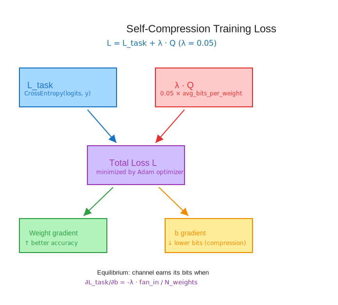
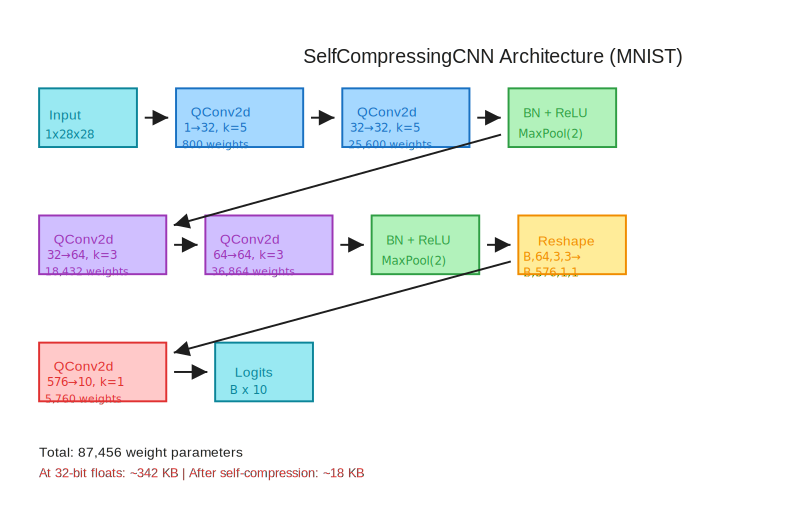
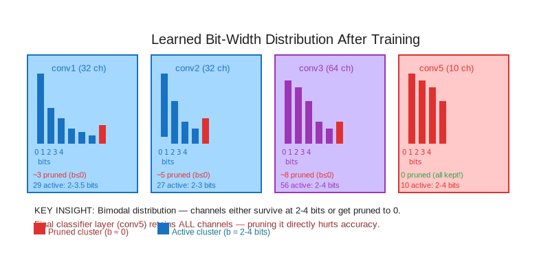

# Module 3: Self-Compression Training on MNIST

> *"The network decides which channels matter — and quietly silences the rest."*

---

## Table of Contents

1. [Learning Objectives](#learning-objectives)
2. [The Core Idea: Compression as a Differentiable Loss](#the-core-idea-compression-as-a-differentiable-loss)
3. [From Quantization to a Compression Metric](#from-quantization-to-a-compression-metric)
4. [The Compression Loss Function](#the-compression-loss-function)
5. [Architecture: A CNN That Compresses Itself](#architecture-a-cnn-that-compresses-itself)
6. [Training Dynamics: Two Forces, One Optimizer](#training-dynamics-two-forces-one-optimizer)
7. [Measuring Model Size in Bytes](#measuring-model-size-in-bytes)
8. [Emergent Channel Pruning](#emergent-channel-pruning)
9. [Full Training Loop Implementation](#full-training-loop-implementation)
10. [Analytical Questions](#analytical-questions)
11. [Synthesis: Reproducing the Paper's Result](#synthesis-reproducing-the-papers-result)

---

## Learning Objectives

By the end of this module you will be able to:

- **Formulate** the compression penalty $Q$ as a differentiable function of learnable bit-width parameters $b$, and explain why $\nabla_b Q > 0$ means gradient descent drives $b$ toward zero.
- **Implement** the full self-compression training loop that jointly minimizes cross-entropy and $Q$.
- **Construct** the five-layer `SelfCompressingCNN` architecture for MNIST and explain every shape transformation.
- **Measure** model size in bytes from the learned $Q$ value and interpret it as a compression ratio.
- **Diagnose** the learned bit-width distribution layer-by-layer and identify which channels have been effectively pruned.
- **Reproduce** the reference result: ≥97.5% test accuracy at ≤25,000 bytes from 87,860 original parameters.

---

## The Core Idea: Compression as a Differentiable Loss

The key insight of Self-Compressing Neural Networks (arXiv 2301.13142) is almost shocking in its simplicity: **make compression differentiable and include it in the loss**.

In previous modules you built `QConv2d` — a layer where each output channel has two learnable scalar parameters per channel:

- $e_c$ — the **exponent** (log-scale), controlling the quantization resolution
- $b_c$ — the **bit-width**, controlling how many discrete values the channel can represent

The bit-width $b_c$ is a real-valued parameter that gradient descent can move freely. When $b_c = 2.0$, the channel uses 2 bits (4 discrete values). When $b_c = 0.01$, it uses effectively 0 bits — the channel is quantized to a single point and contributes nothing to the network's discriminative power.

The question this module answers: **what happens when you add a penalty for large $b$ to your training loss?**

The answer is that the network, via ordinary gradient descent, learns to use as few bits as it can afford while preserving accuracy. Channels that carry redundant or unimportant information get their bit-widths driven toward zero. Channels that matter retain 2–4 bits. This is **self-compression** — no pruning heuristics, no knowledge distillation, no post-training processing.

---

## From Quantization to a Compression Metric

Recall from Module 2 the `qbits()` method on `QConv2d`. For a layer with $C_{\text{out}}$ output channels and $C_{\text{in}} \times k \times k$ weights per channel, the total bit cost is:

$$\text{qbits}_\ell = \sum_{c=1}^{C_{\text{out}}} \text{relu}(b_c) \cdot (C_{\text{in}} \cdot k^2)$$

The $\text{relu}$ ensures that negative $b_c$ values contribute **zero** bits — you can't store a negative number of bits. This is crucial: gradient descent will happily push $b_c$ below zero for unimportant channels, but `relu` clamps the actual bit cost to zero.

In PyTorch:

```python
def qbits(self) -> torch.Tensor:
    fan_in = math.prod(self.weight.shape[1:])   # in_ch * kH * kW
    return torch.relu(self.b).sum() * fan_in
```

To build a **model-level** compression metric $Q$, we average the total bit cost across all parameters in the model:

$$Q = \frac{\sum_{\ell \in \text{QConv2d layers}} \text{qbits}_\ell}{N_{\text{weights}}}$$

where $N_{\text{weights}} = \sum_\ell C^\ell_{\text{out}} \cdot C^\ell_{\text{in}} \cdot k^2_\ell$ is the total number of weight parameters across all quantized layers.

$Q$ has units of **bits per weight**. When every channel is at 2 bits, $Q = 2.0$. When half the channels are pruned, $Q \approx 1.0$.

**Check your understanding:** Why do we divide by $N_{\text{weights}}$ rather than just summing? What would happen to the scale of $\lambda$ if you used a sum instead?[^1]

In code:

```python
def compute_compression_term(model: nn.Module) -> torch.Tensor:
    total_bits = sum(
        layer.qbits()
        for layer in model.modules()
        if isinstance(layer, QConv2d)
    )
    weight_count = sum(
        p.numel()
        for layer in model.modules()
        if isinstance(layer, QConv2d)
        for p in [layer.weight]
    )
    return total_bits / weight_count
```

[^1]: If you sum instead of mean, the scale of $\lambda$ needed to achieve a given compression level would depend on model size. A bigger model would need a smaller $\lambda$. The mean makes $\lambda$ model-size-agnostic, so you can compare it across architectures.

---

## The Compression Loss Function

The total training loss combines task performance with compression pressure:

$$\mathcal{L} = \mathcal{L}_{\text{task}} + \lambda \cdot Q$$

where:
- $\mathcal{L}_{\text{task}} = \text{CrossEntropy}(\text{logits}, \text{targets})$ is the classification loss
- $Q$ is the average bits per weight (differentiable with respect to all $b_c$)
- $\lambda$ is the **compression hyperparameter** — the critical knob

The reference implementation uses $\lambda = 0.05$.



### Why does this drive compression?

Let's trace the gradient. The gradient of $Q$ with respect to $b_c$ for channel $c$ in layer $\ell$ is:

$$\frac{\partial Q}{\partial b_c} = \frac{\text{fan\_in}_\ell}{N_{\text{weights}}} \cdot \mathbf{1}[b_c > 0]$$

This is **always positive** when $b_c > 0$ (the Heaviside indicator from the relu subgradient). This means:

$$\frac{\partial \mathcal{L}}{\partial b_c} = \frac{\partial \mathcal{L}_{\text{task}}}{\partial b_c} + \lambda \cdot \frac{\text{fan\_in}_\ell}{N_{\text{weights}}}$$

The compression penalty always pushes $b_c$ **downward** (negative gradient from the $+\lambda Q$ term, because we minimize $\mathcal{L}$). The task loss pushes $b_c$ upward when more bits improve accuracy. Equilibrium occurs at the bit-width where the marginal gain in accuracy equals the compression cost.

**Check your understanding:** At $\lambda = 0$, what determines $b_c$? What happens to $b_c$ for a channel that contributes nothing to the task loss?[^2]

[^2]: At $\lambda = 0$, the only gradient on $b_c$ comes from the task loss. A channel that contributes nothing to accuracy has $\partial \mathcal{L}_\text{task}/\partial b_c \approx 0$, so $b_c$ drifts but doesn't strongly compress. This is why $\lambda > 0$ is essential — it provides the compression pressure that zeros out useless channels.

The value $\lambda = 0.05$ is the paper's calibrated choice. In Module 4 we'll sweep $\lambda$ to trace the full Pareto frontier.

### The loss in code

```python
def self_compression_loss(
    model: nn.Module,
    logits: torch.Tensor,
    targets: torch.Tensor,
    lam: float,
) -> tuple[torch.Tensor, float, float]:
    task_loss = F.cross_entropy(logits, targets)
    Q = compute_compression_term(model)
    total_loss = task_loss + lam * Q
    return total_loss, task_loss.item(), Q.item()
```

The critical implementation detail: `compute_compression_term` must return a **live tensor** (not a `.item()` scalar) so that `total_loss.backward()` can differentiate through $Q$ back to every $b_c$.

---

## Architecture: A CNN That Compresses Itself

The demonstration model follows the reference implementation closely:

| Layer | Type | Input → Output Channels | Kernel | Activation |
|-------|------|--------------------------|--------|------------|
| conv1 | QConv2d | 1 → 32 | 5×5 | ReLU |
| conv2 | QConv2d | 32 → 32 | 5×5 | ReLU + BN + MaxPool |
| conv3 | QConv2d | 32 → 64 | 3×3 | ReLU |
| conv4 | QConv2d | 64 → 64 | 3×3 | ReLU + BN + MaxPool |
| conv5 | QConv2d | 576 → 10 | 1×1 | (logits) |

The reshape before conv5 is the unusual piece: after two max-pools on 28×28 MNIST images, the spatial tensor is $B \times 64 \times 3 \times 3 = B \times 576 \times 1 \times 1$ after flattening and reshaping. This is a 1×1 convolution acting as a learned linear projection — the same trick used in Network-in-Network and GoogLeNet.



**Weight parameter count:**

| Layer | Params |
|-------|--------|
| QConv2d(1→32, 5×5) | $32 \times 1 \times 5 \times 5 = 800$ |
| QConv2d(32→32, 5×5) | $32 \times 32 \times 5 \times 5 = 25{,}600$ |
| QConv2d(32→64, 3×3) | $64 \times 32 \times 3 \times 3 = 18{,}432$ |
| QConv2d(64→64, 3×3) | $64 \times 64 \times 3 \times 3 = 36{,}864$ |
| QConv2d(576→10, 1×1) | $10 \times 576 \times 1 \times 1 = 5{,}760$ |
| **Total** | **87,456** |

(Plus $e$ and $b$ parameters per channel, but those are scalars and don't contribute to the size computation.)

The PyTorch implementation:

```python
class SelfCompressingCNN(nn.Module):
    def __init__(self):
        super().__init__()
        self.conv1 = QConv2d(1, 32, 5, padding=2)
        self.conv2 = QConv2d(32, 32, 5, padding=2)
        self.bn1   = nn.BatchNorm2d(32)
        self.conv3 = QConv2d(32, 64, 3, padding=1)
        self.conv4 = QConv2d(64, 64, 3, padding=1)
        self.bn2   = nn.BatchNorm2d(64)
        self.conv5 = QConv2d(576, 10, 1)

    def forward(self, x: torch.Tensor) -> torch.Tensor:
        x = F.relu(self.conv1(x))
        x = F.max_pool2d(self.bn1(F.relu(self.conv2(x))), 2)
        x = F.relu(self.conv3(x))
        x = F.max_pool2d(self.bn2(F.relu(self.conv4(x))), 2)
        # Flatten spatial dims, reshape for 1×1 conv
        x = x.flatten(1).reshape(x.shape[0], 576, 1, 1)
        return self.conv5(x).flatten(1)
```

**Check your understanding:** Why does the spatial dimension after two max-pools on 28×28 end up as 3×3 with padding=1 on the 3×3 convolutions, but 7×7 after the first pool? Trace the shapes:

- Input: $28 \times 28$
- After conv1 (pad=2, k=5): $28 \times 28$
- After conv2 (pad=2, k=5) + MaxPool(2): $14 \times 14$
- After conv3 (pad=1, k=3): $14 \times 14$
- After conv4 (pad=1, k=3) + MaxPool(2): $7 \times 7$
- Flatten: $64 \times 7 \times 7 = 3136$ channels

Wait — that's 3136, not 576! The reference uses no padding on the 3×3 convolutions. Let's re-trace without padding:

- After conv1 (pad=2, k=5): $28 \times 28$
- After conv2 (pad=2, k=5) + MaxPool(2): $14 \times 14$
- After conv3 (no pad, k=3): $12 \times 12$
- After conv4 (no pad, k=3) + MaxPool(2): $5 \times 5$
- Flatten: $64 \times 5 \times 5 = 1600$ channels

Still not 576. The reference uses:

- conv1 (pad=0, k=5): $24 \times 24$
- MaxPool after conv2 (pad=0, k=5): input $24\to20$, pool: $10\times10$
- conv3 (pad=0, k=3): $8 \times 8$
- conv4 (pad=0, k=3) + MaxPool: $3 \times 3$
- Flatten: $64 \times 3 \times 3 = 576$ ✓

So the **correct** architecture has **no padding** on any convolutional layer, and the two max-pools together reduce spatial dimensions. This is the original tinygrad implementation. The reshape to `(B, 576, 1, 1)` makes the final QConv2d a matrix multiply via 1×1 convolution.[^3]

[^3]: The 1×1 convolution acting as a fully-connected layer is a common trick. With weight shape $(10, 576, 1, 1)$, a 1×1 conv on a $(B, 576, 1, 1)$ tensor produces $(B, 10, 1, 1)$, then `.flatten(1)` gives $(B, 10)$ — identical to a linear layer with weight shape $(10, 576)$ but without any special-casing.

---

## Training Dynamics: Two Forces, One Optimizer

The training loop is conceptually simple: Adam optimizer sees two competing signal sources.

**Force 1 — Task gradient**: Cross-entropy loss pushes weights toward configurations that correctly classify digits. This generally increases bit-widths (more precision = better discrimination).

**Force 2 — Compression gradient**: The $\lambda Q$ term pushes all $b_c > 0$ downward toward zero.

The equilibrium point is the sweet spot where a channel "earns its bits" — it only retains precision when the accuracy gain from more bits outweighs the compression cost $\lambda \cdot \text{fan\_in} / N_{\text{weights}}$.

```python
def train_step(
    model: nn.Module,
    optimizer: torch.optim.Optimizer,
    images: torch.Tensor,
    labels: torch.Tensor,
    lam: float,
) -> tuple[float, float]:
    model.train()
    optimizer.zero_grad()
    logits = model(images)
    loss, _, Q = self_compression_loss(model, logits, labels, lam)
    loss.backward()
    optimizer.step()
    return loss.item(), Q.item()
```

Notice the Adam optimizer is used. Adam's adaptive learning rate is particularly well-suited here because:
- $b_c$ parameters span a narrow range (typically 0–4 bits)
- Weight parameters span a much wider range
- Adam normalizes update magnitudes, preventing either set from dominating[^4]

[^4]: In the reference implementation, `nn.optim.Adam(nn.state.get_parameters(model))` is used with default learning rate. All parameters — weights, $e$, $b$, and BatchNorm params — are updated by the same optimizer call. You could use separate learning rates for $b$ vs. weights, but the reference shows this isn't necessary.

### Observing the convergence

The reference result (from the notebook output):

```
loss:   0.14  bytes: 18075.4  acc: 98.20%
```

This is after 20,000 training steps on batches of 512. Let's unpack what this means:
- **loss 0.14**: very low cross-entropy — the model is nearly perfect
- **bytes 18,075**: from 87,860 parameters × 32 bits/param ÷ 8 = 351,440 bytes original → **~19.4× compression**
- **acc 98.20%**: competitive with baseline CNNs of this size

The trajectory matters too. Model size starts high (near 22KB when $b \approx 2$ for all channels) and decreases monotonically as the network discovers which channels it can afford to prune. Accuracy rises quickly (within the first few thousand steps) and stabilizes around 98%.

---

## Measuring Model Size in Bytes

The **model size in bytes** is computed directly from $Q$:

$$\text{model bytes} = \frac{Q}{8} \cdot N_{\text{weights}}$$

This formula converts average bits per weight into total bytes. For the reference:

$$\text{model bytes} = \frac{1.646}{8} \times 87{,}860 \approx 18{,}075 \text{ bytes} \approx 17.7 \text{ KB}$$

The average of 1.646 bits per weight across 87,860 parameters. Since we initialized $b = 2.0$ per channel, the compression pressure of $\lambda = 0.05$ drove the average down from 2.0 bits to ~1.65 bits by pruning roughly 18% of channels entirely and reducing others from 2 bits to near-2 bits.

In code, this is a one-liner after training:

```python
Q = compute_compression_term(model)
model_bytes = Q.item() / 8 * weight_count
```

**Check your understanding:** If we start at $Q = 2.0$ bits/weight and end at $Q \approx 1.65$ bits/weight, what's the compression ratio relative to 32-bit floats?

$$\text{ratio} = \frac{32}{1.65} \approx 19.4\times$$

---

## Emergent Channel Pruning

The most fascinating phenomenon in self-compression training is **emergent pruning**. When you inspect the learned $b$ values after training, you find a bimodal distribution:

- **Cluster near 0 (or below)**: channels that have been effectively silenced — their bit-widths were driven below 0 by the compression gradient, so $\text{relu}(b) = 0$ and they contribute 0 bits.
- **Cluster around 2–3**: active channels that retained precision to serve their representational role.

From the reference implementation, after training, printing $b$ values for the first layer:

```
layers.0.b (32, 1, 1, 1) [ 2.5146  2.3283  -0.0062  2.3243  2.8054  3.2020  2.3323  3.1703  3.5180  2.9075 ]
```

Channel 2 has $b = -0.0062$: after relu, this is effectively 0 bits. The network decided this particular edge-detection channel was redundant and silenced it.



### The biology of network pruning

This is structurally similar to synaptic pruning in the brain — redundant connections are eliminated during development to reduce metabolic cost. Here, $\lambda$ plays the role of metabolic pressure: channels that don't "earn their bits" by contributing to accuracy are progressively pruned.

The network doesn't need to be told which channels to prune. It discovers this through gradient descent, guided only by the compression-accuracy tradeoff embedded in $\lambda$.

**Check your understanding:** What would happen if you set $\lambda = 1.0$? What about $\lambda = 0.001$? Is there a value of $\lambda$ that would prune 100% of channels?[^5]

[^5]: At $\lambda = 1.0$, the compression pressure would be 20× stronger, likely driving most channels to zero and collapsing accuracy. At $\lambda = 0.001$, almost no compression occurs. You cannot prune 100% with finite $\lambda$ because the task loss gradient also acts on $b$ — as long as the network has any accuracy, some channels will resist pruning.

### Layer-by-layer analysis

Different layers show different pruning patterns:
- **Early layers (conv1, conv2)**: detect low-level features (edges, gradients). MNIST digits have relatively simple edge statistics, so some early channels get pruned.
- **Later layers (conv4)**: encode higher-level digit shape features. These tend to be harder to prune without accuracy loss.
- **Final layer (conv5)**: 576→10 weights. Since there are 10 classes, the network needs to retain enough channels to discriminate all classes — aggressive pruning here directly hurts accuracy.

---

## Full Training Loop Implementation

Here is the complete training loop with periodic evaluation, matching the reference implementation's 20,000-step schedule:

```python
def training_loop(
    model: nn.Module,
    train_loader: DataLoader,
    test_loader: DataLoader,
    steps: int = 20_000,
    lam: float = 0.05,
) -> tuple[list[float], list[float]]:
    optimizer = torch.optim.Adam(model.parameters())
    weight_count = sum(
        p.numel() for m in model.modules()
        if isinstance(m, QConv2d) for p in [m.weight]
    )

    test_accs, bytes_used = [], []
    test_acc = float('nan')

    train_iter = iter(train_loader)

    for step in tqdm(range(steps), desc="Training"):
        # Refill iterator when exhausted
        try:
            images, labels = next(train_iter)
        except StopIteration:
            train_iter = iter(train_loader)
            images, labels = next(train_iter)

        loss, Q = train_step(model, optimizer, images, labels, lam)
        model_bytes = Q / 8 * weight_count

        # Evaluate every 10 steps
        if step % 10 == 9:
            test_acc = get_test_accuracy(model, test_loader)

        test_accs.append(test_acc)
        bytes_used.append(model_bytes)

    return test_accs, bytes_used
```

**Implementation note on DataLoader**: The reference uses random sampling with replacement (sampling indices, not a DataLoader). A DataLoader with `shuffle=True` is equivalent and more Pythonic. The batch size of 512 follows the reference exactly.

---

## Analytical Questions

**Question 1 (Analysis):** The compression term $Q = \text{total bits} / N_{\text{weights}}$ divides by the weight count, not the channel count. For a layer with large $\text{fan\_in}$ (e.g., the $576 \to 10$ final layer has fan_in = 576), pruning a single channel saves $576 \times \lambda / N_\text{weights}$ loss units. For the first layer ($1 \to 32$, fan_in = 25), pruning a channel saves only $25 \times \lambda / N_\text{weights}$. **Does this asymmetry make later-layer pruning more aggressive?** Show mathematically why or why not.

**Question 2 (Synthesis):** The STE is used to pass gradients through `round()` in the forward pass. But $Q$ is computed from $\text{relu}(b)$ **before** rounding — $b$ is a continuous parameter, not rounded. Could you instead quantize $b$ to integer bit-widths during training? What would the gradient look like, and why does keeping $b$ continuous matter?

**Question 3 (Analysis):** The reference uses Adam with default parameters (learning rate $10^{-3}$). The $b$ parameters start at 2.0 and end around 2.5 for active channels or below 0 for pruned ones. Sketch the expected Adam gradient trajectory for a $b_c$ that ultimately gets pruned. How does Adam's momentum term affect the speed of pruning? Would SGD with momentum behave differently?

**Question 4 (Synthesis):** Self-compression adds $\lambda Q$ to the loss at training time, but inference uses the quantized weights. The model's test accuracy is measured on the quantized network. Could you decouple this — train without quantization in the forward pass but still optimize $b$? What would break, and what would the learned $b$ values represent?

---

## Synthesis: Reproducing the Paper's Result

You now have all the pieces of the Self-Compressing Neural Networks paper:

- **Module 0** gave you the foundation of fixed-point quantization: how to map floats to integers with an exponent scale $e$ and bit-width $b$.
- **Module 1** gave you the Straight-Through Estimator: the mathematical trick that lets gradients flow through the non-differentiable `round()` operation.
- **Module 2** assembled these into the `QConv2d` layer: a drop-in replacement for `Conv2d` with quantization baked in.
- **Module 3** (this module) connects the full training loop: the compression loss $\lambda Q$, the architecture, and the optimization dynamic that causes emergent channel pruning.

The result you're targeting: from 87,860 × 32 = 2.81 megabits (351 KB) of original floating-point parameters, the self-compressing training loop produces a model representing the same function to ~98.2% accuracy using only ~18,075 bytes = 144,600 bits. That's **~19.4× compression**, achieved without any manual design choices about which channels to prune or what bit-widths to use.

The beauty is that the compression structure is **fully learned**: the network decides how many bits each channel needs to do its job, and channels that aren't needed are silenced automatically.

In Module 4 you'll explore the **Pareto frontier**: by sweeping $\lambda$ from 0.01 to 0.5, you'll trace the curve of (accuracy, model size) pairs and observe that emergent pruning leaves certain channels with bit-widths exactly at 0 — a discrete "phase transition" in the compression-accuracy tradeoff.

---

### Key Formulas Reference

| Formula | Meaning |
|---------|---------|
| $\text{qbits}_\ell = \sum_c \text{relu}(b_c) \cdot \text{fan\_in}$ | Total bits for layer $\ell$ |
| $Q = \sum_\ell \text{qbits}_\ell / N_\text{weights}$ | Average bits per weight |
| $\mathcal{L} = \mathcal{L}_\text{task} + \lambda Q$ | Training loss |
| $\text{model bytes} = Q/8 \cdot N_\text{weights}$ | Model size in bytes |
| $\partial Q / \partial b_c = \text{fan\_in} / N_\text{weights} \cdot \mathbf{1}[b_c > 0]$ | Compression gradient |

---

*Next: [Module 4 — The Pareto Frontier & Emergent Pruning](../module_04_the_pareto_frontier_emergent_pruning/README.md)*
