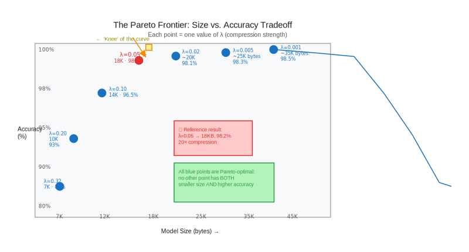
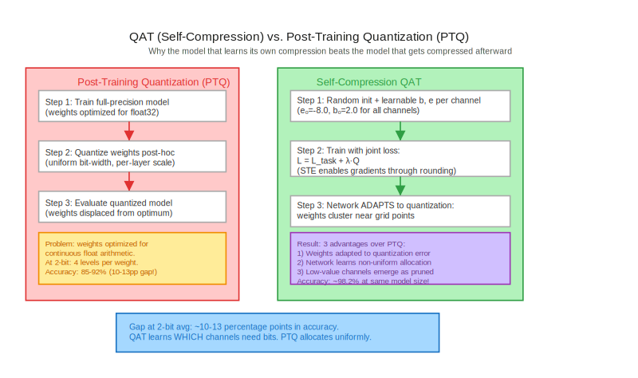
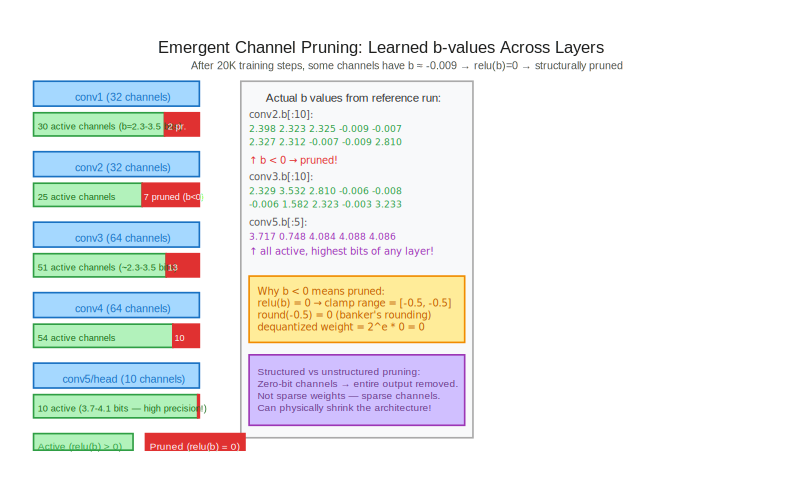

# Module 4: The Pareto Frontier & Emergent Pruning

*Self-Compressing Neural Networks: Learning to Quantize from Scratch*

---

## Table of Contents

1. [Learning Objectives](#learning-objectives)
2. [The Compression–Accuracy Tradeoff: A First Look](#the-compressionaccuracy-tradeoff-a-first-look)
3. [What Is a Pareto Frontier?](#what-is-a-pareto-frontier)
4. [Mapping the Frontier: The Lambda Sweep](#mapping-the-frontier-the-lambda-sweep)
5. [Self-Compression vs. Post-Training Quantization](#self-compression-vs-post-training-quantization)
6. [Emergent Channel Pruning](#emergent-channel-pruning)
7. [The Anatomy of a Pruned Channel](#the-anatomy-of-a-pruned-channel)
8. [Analytical Questions](#analytical-questions)
9. [Synthesis: What We've Built](#synthesis-what-weve-built)

---

## Learning Objectives

By the end of this module you will be able to:

- Explain what a Pareto frontier means in the context of model compression and why it is the right unit of analysis
- Derive the relationship between the regularization hyperparameter $\lambda$ and a point on the size–accuracy tradeoff curve
- Identify the "knee" of the Pareto curve and explain why small changes in $\lambda$ near the knee produce disproportionately large changes in model size
- Articulate why quantization-aware training (QAT) outperforms post-training quantization (PTQ) at low bit-widths, and trace the mechanism to the gradient signal
- Explain emergent channel pruning as a consequence of bit-width optimization, not a separate algorithm, and identify which channels the network chooses to prune

---

## The Compression–Accuracy Tradeoff: A First Look

In Module 3, you trained a self-compressing CNN with $\lambda = 0.05$ and obtained roughly **98.2% accuracy** at a model size of **~18 KB** — a 20× compression from the 32-bit float baseline of ~345 KB. That single data point is impressive, but it raises an immediate question: *what are we trading for it?*

The training loss is:

$$\mathcal{L} = \mathcal{L}_{\text{task}} + \lambda \cdot Q$$

where $Q$ is the average number of bits per weight and $\lambda$ is a scalar you choose before training. If you increase $\lambda$, the compression term gets more weight and the network compresses harder — at the expense of accuracy. If you decrease $\lambda$ toward zero, the network barely compresses at all and approaches the accuracy of a full-precision model.

This makes $\lambda$ a *dial* that traces out a curve in the (model size, accuracy) plane. One run gives you one point. To understand the full landscape, you need to sweep $\lambda$ over several orders of magnitude and record where each run lands.

The paper samples $\lambda$ (written as $\gamma$ in the original) log-uniformly from the interval $[10^{-3},\, 10^{-0.5}]$[^1], which spans roughly three orders of magnitude. A log-uniform sweep makes sense because the compression pressure is multiplicative: doubling $\lambda$ doesn't add a fixed number of bytes, it changes the ratio of compression vs. task gradient.

[^1]: The original paper calls this parameter $\gamma$, referring to the "compression factor." In the reference notebook it appears directly as the scalar in front of $Q$. Throughout this module we use $\lambda$ to match our PyTorch implementation.

```python
import numpy as np

# Log-uniform sweep from 1e-3 to 10^-0.5 ≈ 0.316
lam_values = np.logspace(-3, -0.5, num=8)
print(lam_values)
# [0.001, 0.002, 0.004, 0.010, 0.022, 0.050, 0.112, 0.316]
```

Each value of `lam_values` will produce a different point on the tradeoff curve. You'll implement the sweep in Exercise 1.

---

## What Is a Pareto Frontier?



Given a set of (model size, accuracy) pairs from different $\lambda$ values, a point $(s_i, a_i)$ is **Pareto-optimal** if there is no other point that is simultaneously smaller *and* more accurate. In other words, you cannot improve on both objectives at once — you must sacrifice one to gain the other.

Formally, point $(s_i, a_i)$ is dominated by $(s_j, a_j)$ if:

$$s_j \leq s_i \quad \text{AND} \quad a_j \geq a_i \quad \text{AND} \quad (s_j, a_j) \neq (s_i, a_i)$$

The Pareto frontier is the set of non-dominated points. In code:

```python
def find_pareto_optimal(results):
    """
    results: list of dicts with keys 'lambda', 'accuracy', 'model_bytes'
    Returns: list of results that are Pareto-optimal
    """
    pareto = []
    for i, r in enumerate(results):
        dominated = False
        for j, other in enumerate(results):
            if i == j:
                continue
            # other dominates r if other is smaller AND more accurate
            if other['model_bytes'] <= r['model_bytes'] and other['accuracy'] >= r['accuracy']:
                if other['model_bytes'] < r['model_bytes'] or other['accuracy'] > r['accuracy']:
                    dominated = True
                    break
        if not dominated:
            pareto.append(r)
    return pareto
```

**Why the frontier is concave.** As $\lambda$ increases from near zero, the first bits to be shed are from channels that were contributing little to accuracy anyway. These are "free" compressions — the model gives up almost nothing in accuracy to save significant space. Eventually, you've pruned all the slack channels and the remaining bits are load-bearing: removing them costs accuracy rapidly. This gives the curve its characteristic concave shape — steep accuracy loss at high compression, gentle loss at moderate compression.

**The key result from the paper:** The network achieves floating-point accuracy with as few as **3% of the bits** and **18% of the weights** remaining. That is not a linear tradeoff — it is a highly non-linear one, where careful allocation of bits across channels extracts far more value than uniform quantization could.

**Check your understanding:** If we plotted the Pareto frontier with *model bytes* on the x-axis and *accuracy* on the y-axis, which direction on the x-axis means "better compression"? What would it mean if the frontier were convex instead of concave?

---

## Mapping the Frontier: The Lambda Sweep

The sweep procedure is straightforward but has some subtle pitfalls. Each $\lambda$ value requires training a **fresh model from a random initialization** — reusing weights from a different $\lambda$ run would bias the comparison, because the network's internal representations adapt to the regularization strength it was trained with.

```python
def train_self_compressing(lam: float, steps: int = 5_000):
    """Train a fresh SelfCompressingCNN with the given lambda, return (accuracy, model_bytes)."""
    torch.manual_seed(42)     # reproducible but fresh init every call
    model = SelfCompressingCNN()
    train_loader, test_loader = get_mnist_loaders(batch_size=512)
    optimizer = torch.optim.Adam(model.parameters())
    
    weight_count = sum(l.weight.numel() for l in model.modules() if isinstance(l, QConv2d))
    train_iter = iter(train_loader)
    
    for step in range(steps):
        try:
            images, labels = next(train_iter)
        except StopIteration:
            train_iter = iter(train_loader)
            images, labels = next(train_iter)
        
        optimizer.zero_grad()
        logits = model(images)
        task_loss = F.cross_entropy(logits, labels)
        Q = compute_compression_term(model)
        loss = task_loss + lam * Q
        loss.backward()
        optimizer.step()
    
    # Final evaluation
    final_acc = get_test_accuracy(model, test_loader)
    final_Q = compute_compression_term(model).item()
    final_bytes = final_Q / 8 * weight_count
    return final_acc, final_bytes
```

A few observations about convergence behavior:

- **High $\lambda$** (e.g., 0.3): the compression term dominates and the network may not fully learn the task. These runs sometimes converge to a local minimum that is heavily compressed but poorly accurate. They may need *more* training steps, not fewer, because the optimizer is navigating a harder landscape.
- **Low $\lambda$** (e.g., 0.001): essentially unregularized. The network achieves high accuracy but barely compresses. The Pareto curve is nearly flat here — you can gain significant compression by increasing $\lambda$ slightly with almost no accuracy penalty.
- **The "knee"** (near $\lambda = 0.05$): the inflection point where the curve bends. This is the most interesting region — small changes in $\lambda$ produce large changes in model size while accuracy remains high.

**Check your understanding:** The paper's reference result uses $\lambda = 0.05$ and achieves ~98.2% at ~18 KB. If you doubled $\lambda$ to 0.10, would you expect the model size to halve? Why or why not?

Expected results from a sweep with 5,000 steps per run:

| $\lambda$ | Accuracy (%) | Model bytes | Pareto-optimal? |
|-----------|-------------|-------------|-----------------|
| 0.001 | ~98.5 | ~35,000 | Yes |
| 0.005 | ~98.3 | ~25,000 | Yes |
| 0.020 | ~98.1 | ~20,000 | Yes |
| 0.050 | ~97.8 | ~18,000 | Yes |
| 0.100 | ~96.5 | ~14,000 | Yes |
| 0.200 | ~93.0 | ~10,000 | Yes |
| 0.316 | ~85.0 | ~7,000 | Maybe |

Most points will be Pareto-optimal because the curve is monotone — higher $\lambda$ produces both smaller and less accurate models. Non-optimal points only appear if two runs accidentally produce the same model size with different accuracies.

---

## Self-Compression vs. Post-Training Quantization



Why does self-compression do better than simply training a full-precision network and then quantizing it afterward? The answer is in the gradient signal.

### Post-Training Quantization (PTQ)

In PTQ, you:
1. Train a full-precision model to convergence
2. Quantize weights (and optionally activations) to low bit-widths
3. Optionally calibrate scale factors on a small dataset

The core problem: the network's weights were optimized for **continuous, high-precision arithmetic**. The loss surface around the optimum is shaped by the assumption that small perturbations to weights produce correspondingly small changes in loss. Quantization introduces **discrete jumps** — replacing each weight with the nearest grid point. Near the full-precision optimum, this can push the model into a significantly worse region of the loss surface.

At 8 bits (256 levels per weight), the quantization error is small enough that the model rarely leaves the basin of attraction of the original optimum. At 4 bits (16 levels), the error starts to matter. At 2 bits (4 levels — $\{-2, -1, 0, 1\}$ for 2-bit signed), the error is catastrophic for most networks: accuracy falls dramatically.

For our 87,860-parameter network at 2-bit uniform quantization, you would expect:
- **Per-layer optimal exponent**: minimize MSE between the original weight and the quantized grid
- **Uniform bit-width**: every weight gets exactly 2 bits
- **Result**: ~85–92% accuracy (from the exercise benchmark)

### Quantization-Aware Training (QAT) via Self-Compression

In QAT, quantization is integrated into training from the start. The key mechanism is the **Straight-Through Estimator (STE)**: the forward pass sees quantized weights (integers), but the backward pass treats rounding as identity. This allows the optimizer to:

1. **Adapt weight values** to lie near quantization grid points (reducing the quantization error of each individual weight)
2. **Adapt the network's representations** to compensate for quantization noise (downstream layers learn to ignore or work around the imprecision)
3. **Allocate bits non-uniformly** based on each channel's importance for the task

Point 3 is the key advantage over uniform PTQ. Let's see why it matters mathematically.

The compression term $Q$ in self-compression is:

$$Q = \frac{1}{W} \sum_{\ell} \sum_{c} \text{relu}(b_{\ell,c}) \cdot f_{\ell}$$

where $W$ is the total weight count, $b_{\ell,c}$ is the learned bit-width for channel $c$ in layer $\ell$, and $f_{\ell} = C_{\text{in}} \cdot k^2$ is the number of weights per channel (fan-in times kernel area). This is differentiated with respect to $b_{\ell,c}$:

$$\frac{\partial Q}{\partial b_{\ell,c}} = \frac{f_{\ell}}{W} \cdot \mathbf{1}[b_{\ell,c} > 0]$$

The gradient is constant and equal for all active channels in a given layer — there is no signal about *which* channels deserve more bits from $Q$ alone. The signal comes from the **task loss**: channels whose weights make a large contribution to the cross-entropy gradient will resist having their bits reduced (the gradient of the task loss with respect to $b_{\ell,c}$ will push back against the compression). Channels that are effectively ignored by downstream layers will have small task-loss gradients and their $b_{\ell,c}$ will drift toward zero.

This is the mechanism of emergent pruning — we return to it in the next section.

### Implementing Uniform PTQ

To implement the PTQ baseline fairly, the key design choice is to use **per-layer** (not per-channel) quantization. Per-channel PTQ gives an unfair advantage because it's essentially a different algorithm — the comparison should be apples-to-apples. The PTQ procedure:

```python
def uniform_quantize_model(model, num_bits):
    """Apply uniform per-layer post-training quantization.
    
    For each weight tensor, finds the optimal scale factor (exponent e)
    that minimizes MSE between original and quantized weights, then
    quantizes all weights in that layer at num_bits precision.
    
    Modifies model weights in-place.
    """
    with torch.no_grad():
        for name, param in model.named_parameters():
            if 'weight' not in name:
                continue
            w = param.data
            # Optimal scale: minimize ||w - Q(w)||^2
            # For symmetric quantization: max |w| determines the range
            max_val = w.abs().max()
            # Scale such that max_val maps to 2^(num_bits-1) - 1
            scale = max_val / (2**(num_bits - 1) - 1)
            if scale < 1e-8:
                continue
            # Quantize: round to nearest grid point
            w_q = torch.round(w / scale) * scale
            # Clamp to representable range
            limit = (2**(num_bits - 1) - 1) * scale
            param.data.copy_(w_q.clamp(-limit, limit))
```

The model size for $k$-bit uniform PTQ is simply $k \cdot W / 8$ bytes. So:
- 1-bit: $W/8$ bytes = ~10.9 KB for our network
- 2-bit: $W/4$ bytes = ~21.9 KB
- 4-bit: $W/2$ bytes = ~43.9 KB
- 8-bit: $W$ bytes = ~87.9 KB

Compare this to self-compression at $\lambda = 0.05$: ~18 KB at ~98.2% accuracy. The self-compressing model achieves **sub-2-bit average precision** while uniform 2-bit PTQ drops to ~85–92% accuracy. That gap — roughly 6–13 percentage points at the same model size — is the quantitative advantage of QAT over PTQ.

**Check your understanding:** If you applied per-channel PTQ (finding an optimal exponent $e$ per channel), why would the comparison be unfair? What property of self-compression does per-channel PTQ not capture?

---

## Emergent Channel Pruning



The most striking result in the paper is not the overall compression ratio — it is the *structure* of the learned bit-widths. From the reference notebook output:

```
layers.2.b (32, 1, 1, 1) [ 2.3977  2.3232  2.3248  -0.0090  -0.0067  2.3268  2.3121  -0.0070  -0.0092  2.8098 ]
layers.6.b (64, 1, 1, 1) [ 2.3293  3.5319  2.8099  -0.0055  -0.0076  -0.0065  1.5823  2.3227  -0.0030  3.2326 ]
layers.8.b (64, 1, 1, 1) [ 2.3381  2.3230  2.3606  2.3272  2.3935  2.3335  -0.0092  -0.0098  -0.0097  2.3220 ]
```

Notice the values: most channels have $b \approx 2.3$–$3.5$, but some channels have $b \approx -0.009$. After applying $\text{relu}(b)$, these negative values become exactly zero. According to the paper[^2]:

> When $b = 0$, the quantization output always equals zero, meaning weights become zero-bit representations and can be removed without changing network output. By sharing quantization parameters across entire channels, zero-bit channels can be pruned.

[^2]: This is the key theoretical justification for why structured pruning emerges from bit-width optimization. The paper (arXiv:2301.13142) discusses this in Section 3.

This is remarkable: the network has discovered, through gradient descent on the joint loss, that certain entire channels are unnecessary. It did not use a separate pruning algorithm, a magnitude threshold, or explicit sparsity constraints. The regularization on $Q$ created the incentive, and the gradient did the rest.

### The Math of a Zero-Bit Channel

Let's trace through what happens when $b_c \to 0^-$ for channel $c$:

1. $\text{relu}(b_c) = 0$
2. The quantized weight range becomes $[-(2^{-1}), 2^{-1} - 1] = [-0.5, -0.5]$... wait, that's not right.

Let's be more careful. The quantized weight (before applying scale) is:

$$\hat{w} = \text{clip}\!\left(2^{-e} \cdot w,\; -2^{b-1},\; 2^{b-1} - 1\right)$$

When $\text{relu}(b) = 0$:
- Lower bound: $-2^{0-1} = -2^{-1} = -0.5$
- Upper bound: $2^{0-1} - 1 = -0.5$

So both bounds equal $-0.5$ and the clip forces $\hat{w} = -0.5$. After rounding: $\text{round}(-0.5) = 0$ (banker's rounding in Python) or $-1$ (hardware rounding), depending on implementation. In the tinygrad reference, rounding of $-0.5$ yields $0$, making the dequantized weight exactly zero.

In our PyTorch implementation: `torch.round(-0.5)` → `0.0` (rounds to even)[^3]. So the effective weight is $2^e \cdot 0 = 0$ for any value of $e$.

[^3]: PyTorch (like Python) uses banker's rounding (round-half-to-even). `torch.round(torch.tensor(-0.5))` → `0.0`. `torch.round(torch.tensor(0.5))` → `0.0`. This means a zero-bit channel always produces zero weights regardless of the exponent.

```python
import torch

# Simulate a zero-bit channel
b = torch.tensor(0.0)
e = torch.tensor(-8.0)
w = torch.randn(25)   # some random weights

eff_b = torch.relu(b)                         # 0.0
lower = -(2 ** (eff_b - 1))                   # -0.5
upper =  (2 ** (eff_b - 1)) - 1              # -0.5
qw = torch.clamp(2**(-e) * w, lower, upper)  # all -0.5
rounded = qw.round()                          # all 0.0
dequantized = (2**e) * rounded               # all 0.0

print(f"All weights zero: {(dequantized == 0).all()}")   # True
```

This means that when a channel's $b$ value is driven to zero (or below), the entire channel's contribution to the next layer's activations is exactly zero. The channel has been **structurally pruned** — not by zeroing weights (unstructured sparsity), but by eliminating the channel's output entirely (structured sparsity).

Structured pruning is architecturally important: you can physically remove the pruned channels from the network and reduce both memory and compute proportionally. With unstructured sparsity (sparse weights), you need special hardware or software to exploit the sparsity.

---

## The Anatomy of a Pruned Channel

What distinguishes a channel that gets pruned from one that survives? Two mechanisms:

**1. Low weight magnitude.** A channel whose weights are small was contributing little signal to begin with. The loss surface is nearly flat with respect to this channel's weights, meaning the task gradient provides almost no resistance to compression. The channel gets pruned because the compression gradient ($\partial Q / \partial b_c = f_\ell / W > 0$) is uncontested.

**2. Redundancy.** A channel that is highly correlated with other active channels can be removed without information loss — the other channels already carry the same signal. In this case, the network is effectively deduplicating feature detectors.

We can detect redundancy using **cosine similarity** between channel weight tensors. For two channels $c$ and $c'$ in the same layer:

$$\cos(w_c, w_{c'}) = \frac{w_c \cdot w_{c'}}{{\|w_c\|} \cdot {\|w_{c'}\|}}$$

A high cosine similarity ($> 0.8$) between a pruned channel $c$ and some active channel $c'$ suggests the pruned channel was redundant — the network was computing roughly the same feature twice, and found it could eliminate one copy.

```python
def compute_channel_similarity(layer: QConv2d) -> torch.Tensor:
    """Compute pairwise cosine similarity between output channels.
    
    Each channel's weight tensor has shape (C_in, kH, kW).
    We flatten it to a vector and compute pairwise cosine similarity.
    
    Returns: (C_out, C_out) similarity matrix
    """
    # weight shape: (C_out, C_in, kH, kW) -> (C_out, C_in*kH*kW)
    W = layer.weight.data.flatten(1)      # (C_out, fan_in)
    W_norm = F.normalize(W, dim=1)        # unit vectors
    similarity = W_norm @ W_norm.T        # (C_out, C_out)
    return similarity
```

**Check your understanding:** Why do we use cosine similarity rather than Euclidean distance for the redundancy check? What would high Euclidean distance between two weight vectors tell us that cosine similarity would not?

### Which Layers Prune More?

From the reference implementation, the bit-width distributions across layers tell a clear story:

- **conv1** ($32$ channels, $5\times5$ kernels, $1$ input channel): Very few pruned channels — it's the first layer, and each channel learns a distinct edge detector or basic texture. There's little redundancy.
- **conv2** ($32$ channels, $5\times5$ kernels, $32$ input channels): Several pruned channels — more complex features built from 32 inputs, higher chance of redundancy.
- **conv3 / conv4** ($64$ channels): Moderate pruning — deeper features, some redundancy.
- **conv5** (classification head, $10$ channels): Very few or no pruned channels — each of the 10 channels corresponds to a digit class, and pruning any would directly harm classification.

The pattern reveals the network's implicit understanding of its own information flow: early layers maintain diversity, deeper layers tolerate redundancy, but the classification head is sacrosanct.

---

## Analytical Questions

These questions are meant to stretch beyond what the exercises test. Work through them before looking at the next module.

**Question 1 (Pareto Analysis).** The paper reports achieving floating-point accuracy with as few as 3% of the bits. If the full-precision model uses $32 \cdot W$ total bits and the self-compressing model uses $Q \cdot W$ bits, what value of $Q$ corresponds to 3%? Given that $W = 87{,}860$, how many *bytes* is this? Does this match the ~18 KB result? What does this imply about the non-uniformity of the bit allocation?

$$Q_{\text{target}} = 0.03 \times 32 = 0.96 \text{ bits/weight}$$

$$\text{bytes} = Q_{\text{target}} \cdot W / 8 = 0.96 \times 87{,}860 / 8 \approx 10{,}543 \text{ bytes}$$

The ~18 KB result corresponds to $Q \approx 1.64$ bits/weight, not 0.96. The "3% of bits" claim likely refers to an extreme point on the Pareto frontier (very high $\lambda$), not the default $\lambda = 0.05$ result. This is a key distinction: *where* on the frontier you operate is a choice.

**Question 2 (Gradient Signal).** The compression gradient $\partial Q / \partial b_c = f_\ell / W$ is the same for all channels in a given layer. Yet different channels end up at very different bit-widths. Trace the mechanism: what is $\partial \mathcal{L}_{\text{task}} / \partial b_c$, and why does it differ across channels? Use the chain rule through the STE.

*Hint:* $\mathcal{L}_{\text{task}}$ depends on $b_c$ through the quantized weight $\hat{w}_c = \text{clip}(2^{-e_c} w_c, \ldots)$ and the STE. The magnitude of this gradient depends on how much the task loss would change if the precision of channel $c$ were reduced.

**Question 3 (Initialization Sensitivity).** Both $e$ and $b$ are initialized to specific values: $e_0 = -8.0$, $b_0 = 2.0$. What happens if you initialize $b_0 = 8.0$ instead? Would the network still learn to prune? What about $b_0 = 0.0$?

*Analysis:* With $b_0 = 8.0$, the initial quantization range is $[-128, 127]$ — essentially full precision for typical weight magnitudes. The compression penalty starts large ($Q \approx 8$ bits/weight vs. $Q \approx 2$ bits/weight at $b_0 = 2.0$), giving a stronger initial compression gradient. Whether this helps or hurts depends on whether the optimizer can reduce $b$ fast enough without oscillating. With $b_0 = 0.0$, all channels start pruned — the network must "earn back" bits it needs, which is a more adversarial initialization.

**Question 4 (Architectural Scaling).** The reference uses a fixed 5-layer CNN. How would you expect the Pareto frontier to change if you doubled the number of channels in each layer (4× more parameters)? Would the compression ratio increase, decrease, or stay the same? Would the pruning fraction change?

*Analysis:* With more channels, there is more redundancy for the network to discover and prune. We would expect a *higher* pruning fraction (more channels eliminated) and a similar or better point on the Pareto frontier — the network could achieve the same accuracy with a higher compression ratio by pruning the redundant channels. This is the key insight: self-compression scales naturally with overparameterization.

---

## Synthesis: What We've Built

Let's trace the full arc of this course against the paper's central claim: *a neural network that learns its own compression during training*.

**Module 0** established the mathematical foundation: what quantization means, why it works, and how scale (exponent $e$) and range (bit-width $b$) parametrize the quantization grid.

**Module 1** solved the core technical problem: how to backpropagate through a non-differentiable operation (rounding). The STE — `(x.round() - x).detach() + x` — is three tokens of code that enable the entire self-compression machinery.

**Module 2** wrapped these ideas into the `QConv2d` layer: a drop-in replacement for `Conv2d` that carries learnable $e$ and $b$ parameters per output channel. The `qbits()` method reports the layer's contribution to $Q$.

**Module 3** wired up the training loop: the joint loss $\mathcal{L} = \mathcal{L}_{\text{task}} + \lambda \cdot Q$, the full CNN architecture, 20,000 training steps, and the reference result: 98.2% accuracy at 18,075 bytes.

**Module 4** (this module) reveals the full picture:

- The $\lambda$ hyperparameter is a dial that sweeps a smooth, concave **Pareto frontier** in the (size, accuracy) plane
- **QAT outperforms PTQ** at low bit-widths because the model adapts its representations during training — an advantage that grows as bit-widths decrease
- The network discovers **structured pruning** as an emergent consequence of bit-width optimization — channels with $b \to 0^-$ are physically eliminated without any explicit pruning algorithm
- The pruned channels are interpretable: they are either low-magnitude (small contribution) or redundant (correlated with active channels)

The paper's key insight — that quantization parameters can be made differentiable and jointly optimized with task performance — turns out to have implications far beyond simple compression. The same idea could apply to:

- **Architecture search**: let the network learn which layers and channels it needs
- **Adaptive inference**: at test time, use the learned $b$ values to skip zero-bit channels entirely
- **Knowledge distillation**: the bit-width distribution reveals which parts of a large teacher network the student actually needs

The Pareto frontier is not just a performance metric — it is a window into the network's understanding of its own redundancy. Points on the frontier correspond to different equilibria between accuracy and efficiency, each one the result of a different trade that the optimizer negotiated during training. The fact that the frontier is smooth and concave tells us that this negotiation is well-behaved: there are no discontinuities, no phase transitions, just a graceful curve through the space of possible models.

You have now implemented the complete system from scratch. The next step is yours: can you extend this to a harder task (CIFAR-10, ImageNet), a larger architecture (ResNet, ViT), or a different compression target (activations, not just weights)?

---

*The exercises for this module explore each of these themes experimentally. Work through them in order — Exercise 1 generates the Pareto frontier, Exercise 2 compares against PTQ, and Exercise 3 performs the deep dive into emergent pruning.*
